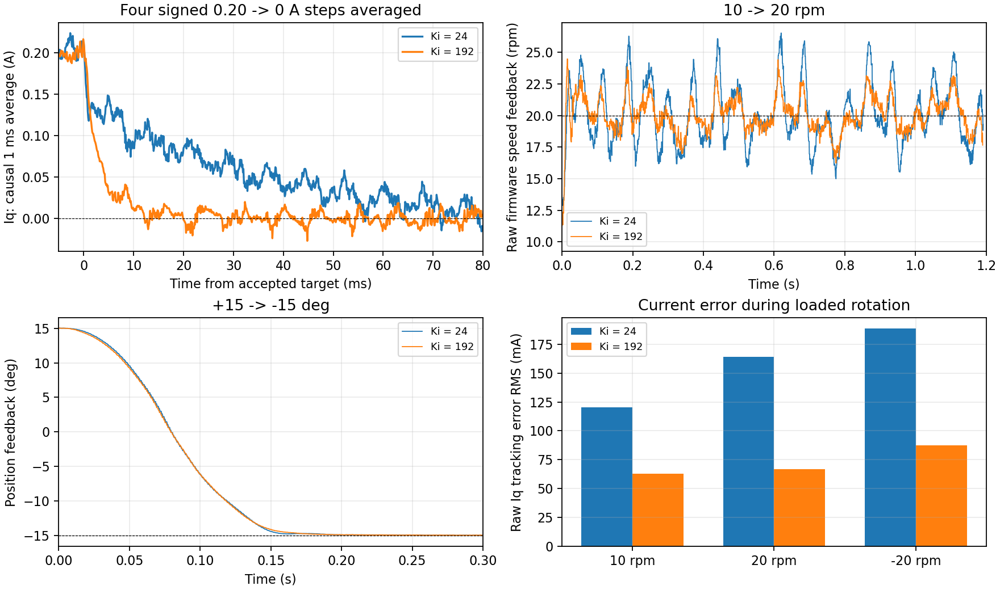

# 塑料臂带载：电流环改进与实机对照

## 本轮保留结果

本轮完成 9 批完整 10 kHz 电流短测和 3 轮塑料臂带载速度、定位测试，保留：

- ZH3620-1 电流环 **Kp=0.20 V/A、Ki=192 V/(A·s)**。
- 积分回算增益仍为 1200/s。
- M0 仍采用顺序 ADC、28 周期采样、触发点 8200，电流控制 10 kHz。
- 正常 USB divider=2，组 6 总览仍为 2.5 kHz、24 通道，VOFA 波特率仍设 1000000。

正式固件已经烧录并校验。最后读取到母线约 12.01 V、待机状态 0、故障 0、拒绝 0、目标 Iq=0；TIM1 CCER=0x1000，仅保留采样触发通道，三相输出关闭。ADC、编码器和时序错误计数均为 0。COM8 已释放。

**改善主要在电流跟踪和回零拖尾；没有证明原始采样噪声被消除。** 小电流偏差减小，带载转动时 Iq 更能跟随外环快速变化的目标，速度波动随之减小。定位保持精度没有明显下降，但部分静止角度的原始 Iq 波动仍然较大。

## 为什么先改积分增益

原电流环 Kp=0.20、Ki=24 是之前小电流实验留下的参数。它能运行，但电流目标从 ±0.20 A 回到 0 后，实测反馈会拖尾几十毫秒。带载外环每毫秒调整一次 Iq 目标时，也存在明显的跟踪误差。

比例部分按当前误差马上调整电压；积分部分累积误差，持续修正需要的电压。积分增益过小，绕组电阻、逆变器非理想特性以及转动过程中所需电压变化，就只能慢慢补偿。本轮实验支持“积分响应偏慢”是现有问题之一，但没有独立识别绕组参数，也没有确认每一种硬件误差的贡献。

Ki 的单位是每秒。10 kHz 下每次积分增量为 `192 / 10000 × 电流误差`，不是每次直接乘 192。此次调整的是 ZH3620-1 的电机参数分支，参考 24 V 电机参数分支沿用原值；实际效果只在这台 M0/TLE5012B 组合上验证。

## 对照怎样做

每批先停机，记录待机 ADC 和相电流，再做两次正、两次负方向序列：

`±0.05 A → ±0.10 A → ±0.20 A → 0 A → stop`

每段命令间隔约 120 ms；启动会经过预充电和 PWM 零偏采集。分析使用遥测中真实的 RUN 状态与电流目标变化，剔除每个稳态段的前 30 ms。停机后的传感器输出不纳入 RUN 的电流残差统计。

实验固件 USB divider=1，组 5 每点是单次原始电流样本，完整记录 10 kHz 数据。正常显示的两次采样平均没有参与此次原始误差比较。所有保留的电流记录均无丢帧、故障或运行电压饱和。

采集脚本修复了切组问题：组 6 是 100 字节帧，旧电流组是 52 字节帧。残留总览帧的尾部可能被旧解析器误识别为一帧旧格式，产生假的序号、时间跳变。现在切组后先排空 50 ms，再开始记录，并继续严格检查连续性。两批只有待机数据的错误记录已排除；修复有模拟串口回归测试。

电流短测中的主机实验边界仍要求反馈转速不超过 ±300 rpm、母线在 8–12.5 V；异常退出会尝试停机。这些条件不修改固件 WARN 策略。

## 参数比较

下表均为非零目标的 12 个稳态分段指标的算术平均。RMS 同时包含采样波动和跟踪偏差，不能直接叫作纯噪声。

| 批次 | Kp | Ki/s | ADC 周期 | 原始 Iq 误差 RMS mA | 1 ms 平均误差 RMS mA | 平均绝对偏差 mA |
|---|---:|---:|---:|---:|---:|---:|
| A_clean 原参数 | 0.20 | 24 | 28 | 85.48 | 20.65 | 5.34 |
| B | 0.20 | 48 | 28 | 64.80 | 15.27 | 1.13 |
| C | 0.20 | 96 | 28 | 82.85 | 18.53 | 1.34 |
| D | 0.30 | 96 | 28 | 86.18 | 17.28 | 1.55 |
| E56 | 0.30 | 96 | 56 | 88.01 | 17.93 | 1.22 |
| F | 0.30 | 192 | 28 | 86.36 | 17.91 | 0.99 |
| A2 原参数复测 | 0.20 | 24 | 28 | 80.17 | 19.53 | 6.65 |
| G 保留参数 | 0.20 | 192 | 28 | 80.38 | 16.65 | 0.69 |
| G2 保留参数复测 | 0.20 | 192 | 28 | 84.51 | 16.87 | 0.93 |

选择理由：

1. 原参数复测仍有偏差和回零拖尾；新参数两批的非零目标偏差约 0.7–0.9 mA。
2. Kp=0.30 并没有稳定降低原始误差，且电压输出波动更大，因此选回 Kp=0.20。
3. Ki=192 明显改善回零，随后带载转动的实测结果也更好。
4. 56 周期没有降噪收益，恢复 28 周期。其配置能力保留为实验选项，窗口预算和 ADC 寄存器使用同一参数；不让二者各自写死。

不同批次的转子起始角度及运动有差异，Id/Iq 的噪声分配会变化。B 批原始 Iq RMS 较小，但 Id RMS 反而较大，因此不能只看这一列宣布 Ki=48 降噪最好。

## 回零拖尾改善多少

原参数两批，回零后 30 ms 至 `stop` 前的平均残差绝对值约 11.7–23.3 mA；保留参数两批均小于 0.7 mA。

下图把四次 ±0.20→0 A 按原电流方向统一符号并平均，再对实际 Iq 做 1 ms 尾随平均，仅用于分析。A2 的平均曲线首次降到 0.02 A 约需 **47.7 ms**，G2 约需 **6.6 ms**。这是这两批平均曲线的首次过阈值，不是持续稳定时间，也不是独立测得的电流环带宽。原始单次记录在阈值附近会有噪声。

固件电流 PI 仍使用未经新增低通的实时反馈，没有把上述分析滤波加入控制器或 VOFA 默认数据。



## 对速度和位置的影响

交替测试顺序为新参数 outerG → 原参数 outerA → 新参数 outerG2。三轮都使用上一轮保留的速度 Kp=0.12、Ki=0.48 和定位 800/640 rpm/s；只改变电流 Ki。每轮最后回到本轮起点再停机，以减小起始姿态差异。

| 指标，最后 0.5 秒 | 原参数 outerA | 新参数 outerG | 新参数 outerG2 |
|---|---:|---:|---:|
| 10 rpm，Iq 跟踪误差 RMS | 120.5 mA | 58.9 mA | 62.7 mA |
| +20 rpm，Iq 跟踪误差 RMS | 164.0 mA | 89.8 mA | 66.6 mA |
| -20 rpm，Iq 跟踪误差 RMS | 188.6 mA | 74.6 mA | 87.6 mA |
| +20 rpm，速度反馈标准差 | 2.216 rpm | 1.311 rpm | 1.332 rpm |
| -20 rpm，速度反馈标准差 | 2.366 rpm | 1.135 rpm | 1.158 rpm |
| 15→-15°，进入 ±0.5° 并连续保持 100 ms | 152.8 ms | 162.0 ms | 161.2 ms |

速度反馈波动约减少 40%–52%，旋转时 Iq 跟踪误差约减少 45%–59%。定位动作略慢约 8–9 ms，但超调保持约 0.03°以内，稳态位置标准差仍约 0.006–0.008°。

静止保持时并非所有电流指标都改善。例如首次回零保持，原参数 Iq 误差 RMS=64.2 mA，两轮新参数为 100.5/86.8 mA。位置反馈稳定性没有同步变差，但需要继续区分角度相关测量噪声和真实力矩波动。不能据此声称“所有工况电流波动都降低”。

新参数完整带载轮次的目标 Iq 峰值约 1.26–1.31 A，主要出现在速度测试后返回起点；未观察到运行电压饱和。当前安培值按板载 ADC 和标称增益换算，未通过独立电流测量标定。

## 源码与验证

| 文件 | 本轮变化 |
|---|---|
| `App/Config/foc_motor.h` | ZH3620-1 电流 Ki 从 24 改为 192 |
| `App/Config/foc_port.h` | M0 的 28/56 周期实验参数；顺序、同步两种窗口预算随参数计算 |
| `App/Hardware/bsp/bsp_adc_m0.c` | ADC 的实际采样长度使用该参数；母线采样长度沿用原值 |
| `tools/bench/current_probe.py` | 切组先排空，避免残留总览帧污染旧格式数据 |
| `tests/test_current_window.c` | 覆盖 28/56 周期、顺序/同步的窗口和抗饱和预算 |
| `tests/test_current_probe.py` | 模拟总览尾部伪装旧格式帧，验证它不会进入新记录 |

四种 M0 采样窗口组合的主机回归通过；默认 M0 的 USB 命令、遥测、三种模式、WARN 目标保持和无效传感器恢复回归通过。实际默认寄存器读回为 28 周期。没有重新校准安装方向，也没有擦除存放校准记录的 Flash 扇区。

原始数据、实验构建和日志在忽略目录 `build/current-improve-20260927/`；每批摘要、原始文件散列、最终固件散列及读回结果在 [数据记录](data/current-loop-loaded-20260927.json)。

## 接下来按什么顺序改

1. **核对测量精度和硬件噪声。** 当前一两个 ADC 码就相当于几十 mA，±0.05 A 目标很接近测量分辨率。先确认电流增益、零偏、VDDA/VREF 和模拟地；仅修改 A/V 系数不会增加分辨率。没有示波器时，可继续做固定角度和重复阶跃的软件对照，但不能独立确认模拟建立过程。
2. **比较有代表性的实际运动电流。** 本轮直接电流阶跃最大 ±0.20 A，带载外环曾产生约 1.3 A 短时目标；后续需要更长时间的动态跟踪、保持和温升记录，不能把小电流短测外推到大电流连续运行。
3. **处理角度与速度估计的长期精度。** 大浮点累计角度的分辨率问题仍未修改。应先拆分单圈角度、整数圈数和局部速度差分，再做跨圈和长跑验证。
4. **再考虑低延迟反馈滤波或前馈。** 若模拟噪声仍占主导，可单独测试轻量反馈滤波，并保持原始遥测可见；如果转动跟踪仍有偏差，应先测电阻、电感和磁链，再加入有依据的前馈。不要把未经测量的参数直接填入当前已关闭的前馈。

复测命令在固件根目录执行，先断开 VOFA 的 COM8；下述 `--kp/--ki` 只标记已经烧录的参数，不会在线调参：

```powershell
python variants/m1-mt6835/tools/bench/current_probe.py COM8 --out build/current-retest --label selected --steps --kp 0.20 --ki 192
```

正常固件采用默认 divider=2，此命令记录 5 kHz、两次采样平均的数据。要复现本文的原始 10 kHz 对照，应另建 divider=1 实验固件，并给采集命令添加 `--usb-divider 1`；实验结束再恢复正常固件。
