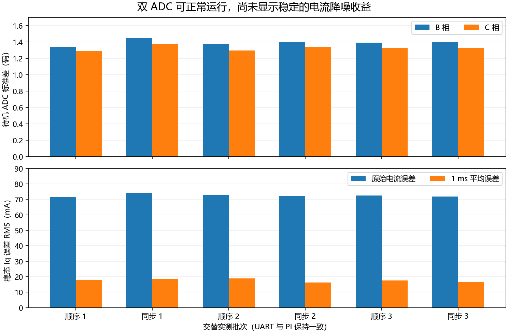

# M0 双 ADC 同步采样实机对照

## 最终选择

**保持顺序采样为默认，已重新烧录。** 双 ADC 可以正常运行，但本轮尚无足够证据证明它能稳定改善当前小电流工况的控制效果。源码保留可选实验配置；正常固件仍使用顺序采样，没有运行时模式切换或新增反馈滤波。

## 实现

同步模式使用 ADC1 注入通道 10 采 PC0/B 相，ADC2 注入通道 11 采 PC1/C 相。二者由 TIM1 TRGO 同步触发，采样长度均为 28 周期，从各自 JDR1 读取。电流完成后，ADC2 再常规转换 PA6 母线电压，与编码器 SPI 重叠。没有改动硬件。

新增 `bsp_adc_begin_bus()`，将采样检查及母线启动放在驱动层：

1. 检查溢出、注入完成状态，以及上一对数据是否已消费；同步模式要求两路注入均完成。
2. 保存本次 B/C 原始码；顺序模式仍取 ADC1 JDR1/JDR2。
3. 清除注入完成状态和旧母线 EOC，再启动新母线转换。
4. 编码器完成后，仅在本次电流数据存在且新母线 EOC 完成时提交结果，避免复用旧数据。

`adc_pair_count`、`adc_bus_count` 用于查看成对采样和数据消费，运行中读取可能相差 0 或 1。无效采样仍关闭输出并报告 ADC 故障，未增加电流、速度或电压阈值限制。

同步模式窗口预算从 544 改为 224 个定时器计数，窗口上限及电角度预测随配置更新。理论两相转换等待从 3.81 µs 降为 1.90 µs，消除两相约 1.90 µs 的时间差；这不等于整体闭环响应提前相同时间。

## 对照条件

- M0 + TLE5012B + ZH3620-1；母线约 11.5 V。
- 电流环 10 kHz，触发 8200，ADC 采样长度 28 周期。
- Kp=0.20、Ki=24，UART 遥测始终开启，USB divider=1，记录完整 10 kHz 数据。
- 两种模式使用同一套新的成对检查及母线调度，区别是 ADC 方式及对应时序预算。
- 顺序 1 → 同步 1 → 顺序 2 → 同步 2 → 顺序 3 → 同步 3。
- 每批先记录待机原始码，再重复两次正负向 ±0.05、±0.10、±0.20 A 短阶跃，随后 Iq=0、stop。
- 排除目标变化后前 30 ms；每批误差指标是十二个非零目标分段指标的算术平均。RMS 包含噪声及均值偏差，不是纯噪声标准差。

## 实测结果

| 模式 / 批次 | B/C 待机标准差（码） | 原始 Iq 误差 RMS（mA） | 1 ms 平均误差 RMS（mA） | 均值偏差绝对值平均（mA） |
|---|---:|---:|---:|---:|
| 顺序 1 | 1.342 / 1.293 | 71.42 | 17.93 | 5.29 |
| 同步 1 | 1.443 / 1.376 | 74.18 | 18.79 | 5.14 |
| 顺序 2 | 1.379 / 1.296 | 72.89 | 18.85 | 5.47 |
| 同步 2 | 1.393 / 1.337 | 72.14 | 16.21 | 4.62 |
| 顺序 3 | 1.391 / 1.329 | 72.57 | 17.53 | 4.51 |
| 同步 3 | 1.400 / 1.326 | 71.88 | 16.74 | 4.55 |



| 三批均值 | 顺序采样 | 同步采样 |
|---|---:|---:|
| 原始电流误差 RMS | 72.29 mA | 72.73 mA |
| 1 ms 平均误差 RMS | 18.10 mA | 17.25 mA |
| 均值偏差绝对值平均 | 5.09 mA | 4.77 mA |
| B/C 待机噪声相关系数 | 0.724 | 0.816 |

原始误差基本持平；1 ms 平均误差整体约降 4.7%，但首组同步更差、后两组更好，改善幅度仍处于几批重复数据的波动范围。均值偏差也没有每组都改善。因此不设为默认，不宣传为已实现明显降噪或提高了电流环带宽。

同步时两路噪声相关性更强。Clarke 变换的 `Ialpha=-Ib-Ic` 叠加共同波动，`Ibeta=(Ib-Ic)/√3` 抵消它。这可以解释同步消除时间错位后，噪声表现仍不一定更好；尚未定位共同噪声的具体电路来源。

## 完整性和时序

- 六批记录均无 USB 丢帧、故障或电压饱和；调试读取的 ADC、编码器及控制时序错误计数均为 0。
- 各批公共 ADC 模式寄存器与所选模式一致，数据消费计数正常递增。
- 采样处理墙钟最大值约 38.24 µs，包含编码器等待和抢占，不覆盖入口之前的全部 ADC 操作。最小 PWM 写入计数 3567，高于当前 600 的时序门槛。
- 主机检查通过：M0 顺序/同步窗口、全电角度饱和调制及抗积分饱和；M0 同步配置的统一命令及遥测；M1 原窗口回归。
- M0 + MT6835 同步配置及 M1 + MT6835 参考配置编译通过，未在本轮接对应硬件运行。

## 恢复后的状态

已烧录并校验 M0 + TLE5012B 默认顺序模式，触发 8200，Kp=0.20、Ki=24，USB divider=2、5 kHz 遥测，CDC 参数 1000000，UART 功能保留。

恢复短测中，+0.20 A 内部稳态读数约 +0.1964 A，−0.20 A 约 −0.1905 A。10 秒 USB 检查通过：50007 帧、约 4999.9 帧/s。最终 idle、fault=0、warnings=0，ADC/编码器/时序错误计数为 0，三相输出关闭。

安培值沿用尚未外部标定的换算比例。本次只覆盖小电流、低速短测，没有验证高速、带载和大调制量下的同步收益，也没有直接测模拟建立时间。

## 如何再次选择

`FOC_M0_ADC_MODE=SEQUENTIAL` 是默认，`DUAL` 为可选实验配置。它属于接口采样驱动，与电机和编码器型号独立；M1 保持原同步 DMA 路径。

```powershell
cmake --preset Debug-local -B build/Dual-adc-check -DFOC_PORT=M0 -DFOC_ENCODER=TLE5012B -DFOC_MOTOR=ZH3620_1 -DFOC_M0_ADC_MODE=DUAL -DFOC_USB_DIVIDER=1
cmake --build build/Dual-adc-check
```

恢复时明确指定 `-DFOC_M0_ADC_MODE=SEQUENTIAL -DFOC_USB_DIVIDER=2`，避免沿用实验缓存。

原始数据、构建身份、烧录和寄存器日志在本机 `variants/m1-mt6835/build/bench_debug/20260927_dual_adc/`。归档指标见[数据摘要](data/dual-adc-20260927.json)。下一步可独立比较 ADC 采样长度、同周期平均及剩余模拟噪声，每次只改变一个因素。
