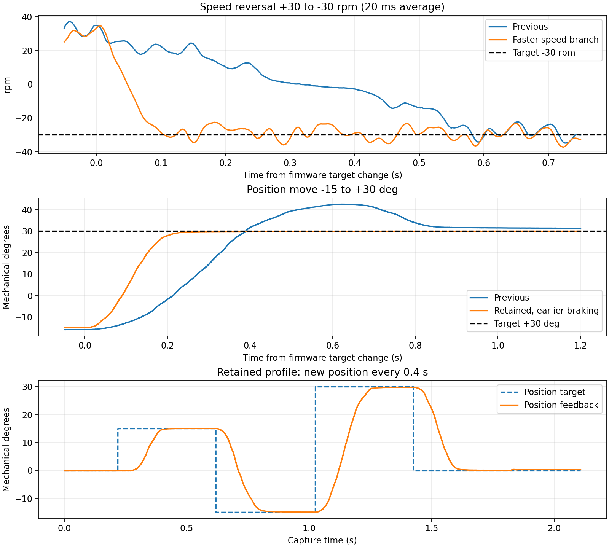

# 速度切换和定位响应优化记录

## 1. 本轮结论

2026-09-27，在 M0 + TLE5012B + ZH3620-1、空载、母线约 11.4–11.9 V 上，比较了速度斜坡、位置增益、速度积分和提前制动的多组参数。已编译、烧录并校验保留方案。电流环仍为 10 kHz，USB 为 5 kHz JustFloat，VOFA 波特率仍设 1000000，ADC 默认顺序采样。

**连续换目标明显变快，位置超调也明显减小。低速转速的周期波动仍存在，所以“响应快”还不能理解成“精密匀速”。** 以下时间从固件遥测中目标首次改变开始计算；角度和电流都是板载反馈，没有做外部绝对标定。

| 工况和判定方式 | 本轮开始时的慢速参数 | 改进结果 |
|---|---|---|
| +30 → −30 rpm，达到本次速度变化的 90% | 0.527–0.543 s | 0.083–0.084 s；最终速度参数相同，实测于 selected_fast |
| +60 → −60 rpm，同一 90% 判定 | 本轮未测慢速参数 | 最终固件两次 0.135–0.139 s |
| +15° → −15°，最大超调 | 5.50–6.95° | 保留方案三次不超过 0.058° |
| −15° → +30°，最大超调 | 12.45–12.60° | 保留方案三次不超过 0.035° |
| 15°、−15°、30°、0°，到位后在 ±0.5° 内保持至少 100 ms | 部分动作未在 1.5 s 指令间隔内满足 | 保留方案 12 次约 0.185–0.262 s，最大超调 0.102° |
| 每 0.4 s 更换上述位置目标 | 本轮未测慢速参数 | 最终固件 8 次约 0.176–0.246 s 到位，最大超调 0.051° |
| 45°、−45°、90°、0°，包含最大 135° 行程 | 本轮未测慢速参数 | 最终固件两个完成批次约 0.274–0.457 s 到位，最大超调 0.747°；中间一轮中止，见下文 |
| 四次位置保持，各等待 5 s，统计末尾 0.7 s | 前一阶段已能保持 | 最终固件平均误差不超过约 0.0025°，位置标准差 0.007–0.010° |

位置到位时间指**第一次进入误差带、且随后连续保持 100 ms 的时刻**，不是再加 100 ms 后的时间。速度先取 20 ms 尾随平均，再计算变化完成 90% 的时刻；平均滤波本身会增加测得的时间。不能把这个指标称为进入并持续保持 ±3 rpm：30/60 rpm 测试仍有约 7–8 rpm 的周期偏离，部分工况不满足 ±3 rpm 连续 100 ms。



## 2. 为什么原来慢，以及怎么修改

### 速度斜坡成为主要等待时间

原先速度目标每秒只能改变 100 rpm。+30 → −30 rpm 单是内部斜坡就要 0.6 s，增加 PI 增益无法跳过它。现在速度模式使用 900 rpm/s：理论规划时间约 0.067 s，实测 90% 响应约 0.083 s。位置模式独立使用 600 rpm/s，方便分别调整匀速切换和到位动作。

这两个参数属于电机配置，与 M0/M1 功率接口、编码器型号分开。换电机后应重新测量可用加速度；不是把同一个增益直接套到所有电机上。

### 位置环需要提前减速

旧位置环只把角度误差乘 Kp 得到目标转速，再经过速度斜坡。当目标接近时，原先规划的转速不能马上降下来，因此会越过目标后再追回，尤其在大行程或反向时。

现在先计算三个候选速度，采用最小的幅值，并朝目标方向运动：

1. 位置比例输出：`Kp × 剩余角度`，目标附近平滑收尾。
2. 位置最高速度：90 rpm，远处允许快速移动。
3. 依照剩余距离计算的制动速度：`sqrt(制动参数 × 剩余角度 / 3)`，接近目标提前减速。

这个公式来自匀减速停止距离。转速单位为 rpm，角度单位为机械度：`停止距离 = 3 × 转速² / 加速度`。例如 60 rpm、480 rpm/s 对应 22.5° 的规划制动距离。该公式只是规划近似，真实停止还受电流环、机械惯量和供电能力影响。

保留方案的实际斜坡为 600 rpm/s，但制动距离按较小的 480 rpm/s 计算，预留更长停止距离。600 的方案更快一点，却有约 0.85° 的小角度超调；提前制动的方案约慢几十毫秒，12 次标准定位最大超调降到约 0.10°。

采用加速、接近和制动的思路也可参见 [ST 位置控制说明 AN5464](https://www.st.com/resource/en/application_note/an5464-position-control-of-a-threephase-permanent-magnet-motor-using-xcubemcsdk-or-xcubemcsdkful-stmicroelectronics.pdf)。本项目的制动公式和参数是本轮独立实现、实测调整的结果。

### 适当提高速度积分，不继续堆增益

速度 Kp 保持 0.06 A/rpm，Ki 从 0.12 提高到 0.24 A/(rpm·s)，位置 Kp 从 2 提高到 10 rpm/°。曾测试 Ki=0.36、位置 Kp=12、加速度 900 的组合：反向更快，但定位超调增大至约 0.89°；只提高 Ki 的混合方案也出现约 1.04° 超调，因此未保留。

此前的快速角度/速度观察器、模式切换清除旧输出、同模式连续更新保持积分、电压饱和时抑制积分增长均保留。没有改变电流 PI，也没有增加会使运行目标锁死的新保护。

## 3. 保留参数与代码位置

| 项目 | ZH3620-1 当前参数 |
|---|---|
| 速度 Kp / Ki | 0.06 / 0.24 |
| 速度模式加减速 | 900 rpm/s |
| 位置 Kp | 10 rpm/° |
| 位置最高速度 | 90 rpm |
| 位置模式斜坡 | 600 rpm/s |
| 位置制动距离参数 | 480 rpm/s |
| 电流 Kp / Ki | 0.20 / 24，未改变 |

参数在 `variants/m1-mt6835/App/Config/foc_motor.h`。轨迹规划在 `App/Control/control.c` 的 `outer_output()` 中，由共用 1 kHz 外环执行。参考电机仍有独立参数，新增的位置加速度和制动参数均为 1000 rpm/s，未冒用 ZH3620-1 的实测结果。

`tools/bench/response_probe.py` 保存目标切换、原始帧和到位统计；`tests/test_response_probe.py` 检查 USB 积压、24 位时间戳回绕和目标匹配。早期按电脑发送时刻统计会受 USB 缓冲影响，本轮已改为固件目标与采样时间戳，并重算所有比较数据。

最终 Debug 构建和差异格式检查通过；M0 完整命令/遥测/三模式回归、M0 10 kHz 与 M1 20 kHz 观察器回归、M1 参考电机 TRIP 被控对象回归，以及响应统计测试均通过。主机模型验证接口和算法约束，不能替代其他接口、编码器或负载的实机测试。

## 4. 如何使用和观察

VOFA 选择 COM8、1000000、JustFloat；命令每行附加真实换行。发送 `send 3` 后，在同一个图表显示：

- 速度：通道 8（最终速度目标）和通道 6（速度反馈）。通道 8 不是斜坡内部速度参考；位置模式中它是随距离变化的规划速度。
- 位置：通道 5（位置目标）和通道 4（位置反馈），单位 °。
- 电流：通道 3（Iq 目标）和通道 2（Iq 反馈），单位为内部标称 A。

速度连续测试逐条发送：

```text
rpm 30
rpm -30
rpm 0
stop
```

位置先停机定义零位，再逐条发送：

```text
stop
zero
pos 15
pos -15
pos 30
pos 0
hold
stop
```

**连续换目标时，直接发送新的 rpm 或 pos。** `stop` 关闭输出，下次起动要重新经历约 2 ms 预充电、1 ms 等待和 50 ms PWM 校零，因此冷启动额外等待约 53 ms。`rpm 0` 为零转速闭环，`pos 0` 保持软件零位，`hold` 以当前位置作为新目标；它们都不等同停机。

## 5. 验证范围和仍存在的问题

标准保留方案的三个定位批次、最终每 0.4 s 切换的两个批次，以及最终大角度首轮均没有丢帧或固件故障。内部 Iq 指令在最终快速位置试验最大约 0.824 A，大角度首轮约 0.914 A；最终 ±60 rpm 的两轮最大约 1.016 A。这里没有外部电流增益标定。

最终大角度第二轮在 `pos 90` 附近，母线遥测降到 7.973 V，主机实验脚本主动发送 stop。停机后的只读记录随后发现编码器故障 1。这一轮未通过，不纳入成功统计；目前不能确认是供电跌落、编码器连线、干扰还是模拟测量问题。用户检查复位后，软件母线读数约 12 V，大角度重试及四次各 5 s 的保持均通过，未再出现异常。异常暂时恢复，但根因尚未确认；没有通过放宽测试边界掩盖这次中止。

最终停止状态的 ST-Link 回读确认 PWM 关闭，ADC 错误、编码器累计错误、命令拒绝和时序故障均为零。该计数覆盖复位后的大角度重试及保持，**复位前的异常仍单独保存**。采样链路最大墙钟跨度为 6489 个 168 MHz 周期，约 38.63 µs，包含 SPI 等待和抢占，不是纯 CPU 占用；一个极值不能证明所有中断截止裕量。Flash v3 安装身份 0x22110007 和方向 −1 保留，当前 ELF SHA256 为 `bf0137135aa986dcddec9e23e9cef93135393d47a2b662dd6122ba6b36c7ef8a`。

后续按顺序处理：

1. **先稳定供电及编码器连接。** 同时观察电源是否限流；没有示波器时，软件记录仍不能排除短时供电和波形问题。
2. **处理低速周期波动。** 同步记录位置、速度、Iq、Id，分辨编码器角度谐波与真实转矩波动，再决定角度补偿或转矩补偿。不要先把速度滤波时间加大，否则响应会再次变慢。
3. **验证外力扰动恢复。** 最后四次各 5 s 保持，末尾 0.7 s 平均误差 −0.0013°、−0.0022°、+0.0002°、+0.0024°，位置峰峰值 0.044–0.055°。这证明本次空载静态保持，没有验证外力和负载下的精度。
4. **再调实际负载参数。** 增加惯量后重新调整位置斜坡、提前制动和速度 Ki；当前结果仅为空载短测，没有长时间温升或高速验收。
5. 若还需要更柔和的加减速，可加入限制加速度变化率的 S 曲线。当前已解决主要斜坡等待和越位问题，S 曲线会在平顺性与响应时间间作新权衡，应另做对照。

## 6. 数据索引

[汇总数据](data/fast-response-20260927.json) 包含慢速基线、各候选参数、保留方案和中止记录。原始帧保存在本机 `variants/m1-mt6835/build/bench_debug/20260927_response/`，不进入版本库。`final_large` 仅包含实际完成的三个工况批次；失败的第二个位置批次单独标为 aborted；`final_large_retry` 为复位后重试；`final_hold` 为四次各 5 s 保持。保持统计按末尾 0.7 s，早已结束运动；响应统计均按固件目标时间。

前一阶段的起转和保持能力改进仍见[早期外环调试记录](speed-position-debug-2026-09-27.md)，其中较慢的参数已被本报告替代。
