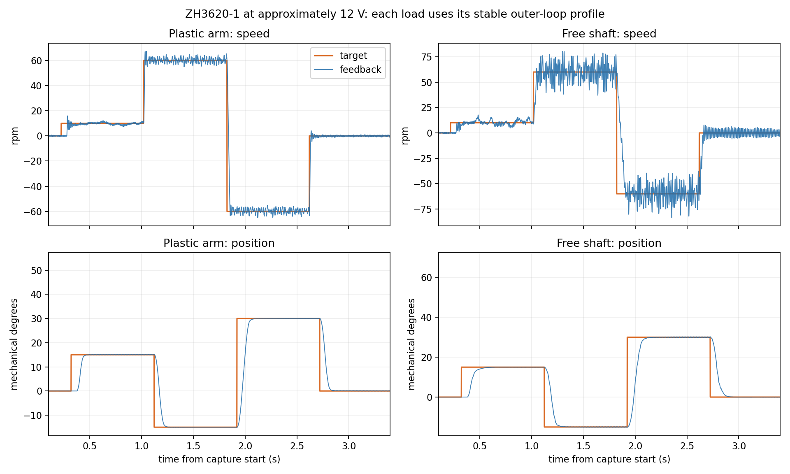

# 卸下塑料臂后的 FOC 对比与调参（2026-09-28）

本页的带臂位置到位数据是定位提速前的基线；后来保留了更快的带臂位置轨迹及新的短时诊断门槛，见[定位提速与优化清单](position-speedup-and-foc-roadmap-2026-09-28.md)。速度模式、电流环与裸轴配置保持本页所述参数。

## 结论

在同一块板的 M0 接口、同一台 ZH3620-1 电机和 TLE5012B 编码器、约 12 V 母线下，塑料臂卸除后，**电流环无需改动，速度环和位置环需要换一套参数**。保持带臂固件不变，裸轴首次执行 `rpm 10` 时，目标 Iq 曾瞬间到约 −7.20 A，PC 测试程序按预设实验边界立即发送 `stop`。这一次测试没有得到可用的完整速度响应，不能把它称为正常运行。测试期间母线约 12 V。之后降低速度比例增益、重调积分与定位轨迹，裸轴完成两轮最终短测，故障和 USB 丢帧均为零。

根据用户随后指定，工程默认、当前构建配置和**最终留在板上的固件**均改为 **`PLASTIC_ARM`**；卸下塑料臂测试时选 **`FREE_SHAFT`**。两套参数只与 ZH3620-1 的机械负载有关，M0/M1 仍表示板上功率接口，TLE5012B/MT6835 仍表示编码器型号。电流 PI、SVPWM、USB 数据格式和保护策略共用。裸轴实验曾烧录 `FREE_SHAFT` 完成验收；装回塑料臂后又烧录 `PLASTIC_ARM` 并复测。没有在带臂状态下实测裸轴配置。

## 怎么比较

先用带臂最终固件直接卸臂复测，得到上述启动异常；随后用**同一固件**重复 `±0.05、±0.10、±0.20 A` 小电流阶跃，判断内环是否随负载变化。再针对裸轴扫描速度环比例/积分、速度目标变化率、位置环参数，逐项记录响应。最后烧录默认裸轴固件，实测两轮 `10→60→−60→0 rpm`、两轮 `15→−15→30→0°`，并用每段 3 秒的数据检查长期保持。所有正常完成的最后测试都由脚本发送 `stop`。

“到位”定义与[塑料臂基线测试](loaded-arm-fast-tuning-2026-09-28.md)相同：速度反馈取尾随 20 ms 均值，必须进入目标 ±3 rpm 且保持 100 ms；位置进入 ±0.5° 且保持 100 ms。时间从固件遥测确认新目标开始，不包含电脑发送及 USB 排队。`t90` 只表示首次越过 90% 响应阈值，不能代替稳定到位。位置精度和转速都来自板上编码器，没有用外部仪表独立验证真实轴运动。

## 结果

| 项目 | 塑料臂，带臂参数 | 裸轴，最终裸轴参数 | 判断 |
|---|---:|---:|---|
| 相同固件小电流阶跃：六个非零段平均绝对偏差 | 0.69 mA | 2.54 mA | 仍为毫安级；未发现必须重调电流 PI 的证据 |
| 相同固件小电流阶跃：1 ms 平均误差 RMS | 12.72 mA | 15.49 mA | 略增，采样噪声和姿态也会影响结果 |
| 相同固件小电流阶跃：原始误差 RMS | 34.04 mA | 35.67 mA | 基本相近 |
| 3 秒 +60 rpm：末段反馈均值、标准差 | +59.98、1.94 rpm | +59.91、8.13 rpm | 平均速度准确，裸轴反馈起伏明显增大 |
| 3 秒 −60 rpm：末段反馈均值、标准差 | −60.00、1.88 rpm | −60.00、8.92 rpm | 同上；两列外环参数不同，不能全归因于塑料臂 |
| +60→−60 rpm：最终速度到位 | 43.4 ms | 未满足 ±3 rpm 连续 100 ms | 裸轴首次到达 90% 约 86–87 ms，但持续摆动 |
| 连续 15→−15→30→0°：两轮位置到位 | 约 127/106/140/108 ms | 约 155/161/213/171 ms | 裸轴更慢，但重复性好，超调小 |
| 连续换位目标 Iq 峰值 | 常见约 2.2 A | 最终短测约 1.06 A | 新参数以降低空载摆动为代价放慢定位 |

表中的 3 秒稳速标准差是固件反馈原始统计值，不代表转速计测得的真实机械波动。**塑料臂与裸轴的稳速列采用了各自可稳定运行的不同外环参数**；唯一保持完全相同固件的直接对照是小电流阶跃和那次被中止的速度启动，因此不能把 1.9→8–9 rpm 的全部变化定量归因于转动惯量。卸臂后小电流 Iq 环仅略变，而高增益外环出现大瞬态，说明此负载变化对外环的影响远大于内环。

裸轴最终短测中的 `+60→−60 rpm` 首次到 90% 为 85.8、87.4 ms；两次 +60 rpm t90 为 46.2、43.0 ms，均值约 60 rpm，目标 Iq 最大约 1.07 A。位置常规两轮的四段到位分别是 `212/151/190/159 ms` 和 `155/175/184/165 ms`，最大位置超调约 0.20°。0.4 秒连续换位的两轮到位约 `155/161/213/171 ms` 和 `156/161/213/172 ms`，最大超调约 0.07°。3 秒定点保持的末段位置反馈标准差在 −15/30/0° 约 0.013–0.015°，在 +15° 为 0.084°。这些数据没有故障与 USB 丢帧。



图中各列用自己的稳定参数，两种负载的命令顺序和采样方法相同。完整指标见[机器可读 JSON](data/free-shaft-vs-plastic-arm-20260928.json)；带臂旧测、裸轴测试、重新装臂复测各两条约 1 kHz 波形存于[压缩归档](data/free-shaft-vs-plastic-arm-20260928.npz)。本机 `build/unloaded-20260928/` 中保留 5 kHz 原始帧、每档扫描与自动中止记录，该目录被 Git 忽略。

## 装回塑料臂后的最终验收

用户确认塑料臂已装回，随后将默认构建目录切到 `PLASTIC_ARM`，经 ST-Link 下载、校验及复位。重新装臂后的两轮 `10→60→−60→0 rpm`，+60→−60 rpm 到位分别为 **43.4、43.2 ms**，+10→+60 rpm 到位为 **25.4、25.8 ms**；两轮均满足 ±3 rpm 连续 100 ms 的到位条件。两轮 `15→−15→30→0°` 到位分别约 **128/106/134/109 ms** 与 **127/107/137/109 ms**。两轮最大目标 Iq 为 **2.79、2.68 A**，无故障、无 USB 丢帧。这与卸臂前的带臂结果接近，说明恢复负载后原带臂调参仍可重复；这些仍是短时响应测试。

当次向板子发送 `stop`，VOFA 总览读取母线 **12.02 V**、模式/运行状态/故障均为 0、目标 Iq 与目标转速均为 0、告警与命令拒绝数均为 0。该次 ST-Link 验证成功的带臂固件 SHA-256 为 `79e394343aca788390be789c599d4be7f53020e4d82d6c47258305557d1de108`；随后已被[定位提速固件](position-speedup-and-foc-roadmap-2026-09-28.md)替换。本次没有做装回塑料臂后的 3 秒稳速或长时间温升测试。

## 最终参数与取舍

| 参数 | 塑料臂 `PLASTIC_ARM` | 裸轴 `FREE_SHAFT` |
|---|---:|---:|
| 电流 PI Kp / Ki / 抗饱和回算 | 0.20 / 192 s⁻¹ / 1200 s⁻¹ | 相同 |
| 速度模式 PI Kp / Ki | 0.18 / 0.48 | 0.04 / 1.20 |
| 速度目标变化率 | 4500 rpm/s | 1500 rpm/s |
| 位置模式内层速度 Kp | 0.18 | 0.03 |
| 位置 P Kp | 12 rpm/° | 6 rpm/° |
| 位置加速 / 刹车 | 当前 4000 / 3200 rpm/s；本页比较时 2000 / 1600 | 1200 / 960 rpm/s |
| 位置最高接近速度 | 当前 150 rpm；本页比较时 90 rpm | 90 rpm |

裸轴试了速度 Kp=0.03～0.05、Ki=0.12～1.20，以及 900、1500、2500 rpm/s 斜率。Kp=0.05 的短测触及 PC 的约 2 A 实验边界而停机；Kp=0.04 可完成。斜率 900→1500 使换向 t90 约从 132 ms 降到 84–87 ms，稳速起伏相近；2500 虽进一步缩短首次响应，稳速波动略增，因此最终选 1500。位置模式单独使用 0.03 速度 Kp，可避免速度模式较高 Kp 给定点保持带来的更大摆动。此前试过把速度观察器滤波时间加到 5 ms，反而出现实验边界中止，最终恢复 1 ms 设置。

目前裸轴 ±60 rpm 的反馈仍有约 8–9 rpm 标准差，尚达不到连续 100 ms 保持在 ±3 rpm 的要求。用户未能确认肉眼/听觉是否感到抖动，不能认定这一数值全是真实机械振动。下一步应在可用时用独立测速或轴标记视频核对真实转速，再检查编码器磁钢同轴度、固定与角度微分噪声；若真实轴确实摆动，再继续测量电流标定、相电流采样同步和电机齿槽转矩。单纯继续提高外环增益在本轮已出现更大电流尖峰。没有独立温升记录，也没有对额定转矩或持续工作做验收。

## 使用两套负载配置

源码默认和 `build/Debug` 构建配置为 `PLASTIC_ARM`。在项目根目录，用 VS Code 对应的 CMake 配置或以下命令切换。每次切换后都要重新编译并烧录，`hello` 的 UART 文本会显示 `load=FREE_SHAFT` 或 `load=PLASTIC_ARM`；USB 的 VOFA 二进制波形格式不变。

```powershell
cmake --preset Debug-local -DFOC_LOAD_PROFILE=PLASTIC_ARM
cmake --build --preset Debug-local
```

卸下塑料臂时，将第一行改为 `-DFOC_LOAD_PROFILE=FREE_SHAFT`。这里选择的是负载调参，不更改接口、电机或编码器型号；若相线、磁钢或编码器安装位置发生变化，仍需重新检查校准与转向。

裸轴验收固件 SHA-256 为 `a9c0ba079d8011e9413be18f8ea2ec1913eb7e65ded7b4b575190cb45d8ec53a`，当时经 ST-Link 下载、校验及复位，随后已被带臂固件替换。两种负载的配置都通过 M0 参数及命令主机测试；两种负载的控制观察器测试和响应计算测试通过。测试脚本最后发送 `stop`；本次记录只覆盖当前接线、约 12 V 和短时工况。
