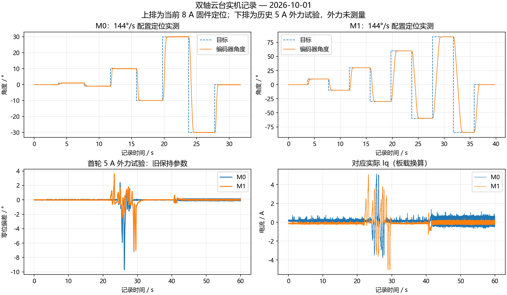

# 双轴云台提速与抗扰调试（2026-10-01）

后续用户纠正了轴名称：当前 M0 为俯仰、M1 为水平。本页 M0/M1 数据编号不变；更快的 48 RPM 固件与滑条界面见 [后续提速与界面更新](gimbal-slider-speedup-2026-10-01.md)。

本轮针对原固件动作慢、受到外力后保持不足进行带载调试。M0 允许连续多圈，M1 目标范围仍为 ±85°、实际行程保护 ±90°。每次 MCU 复位以第一笔有效角度建立行程中心；校准记录保持原安装参数，没有重新校准。

## 当前烧录参数

| 参数 | M0 | M1 |
|---|---|---|
| 最大轨迹速度 | 24 RPM（144°/s） | 同 M0 |
| 轨迹加减速 | 80 RPM/s（480°/s²） | 同 M0 |
| 运动位置 P | 4 rpm/° | 同 M0 |
| 到位保持位置 P | 8 rpm/° | 6 rpm/° |
| 到位保持直接恢复电流 | 0.20 A/° | 同 M0，按校准方向换算 |
| 速度 PI | 0.08 / 0.60 | 0.12 / 0.40 |
| 外环速度滤波 | 1 ms | 4 ms |
| Iq 给定限幅 | ±8 A | 同 M0 |
| 原始相电流停机阈值 | 10 A | 同 M0 |
| 电流电压矢量上限 | 母线 45% | 同 M0 |
| 正常运行硬超速停机 | 40 RPM | 同 M0 |

电流 PI 保持 0.20/192，未通过放慢电流反馈来掩盖噪声。位置模式在 24～25 RPM 削减加速电流，M0 超过 25 RPM 主动反向制动，最多 8 A。相电流、速度、实际行程、有效采样和母线保护保留；固定磁场诊断和限时电流/速度诊断的原限值保持。

到位后连续 100 ms 满足位置误差 ≤0.15°、速度 ≤1.5 RPM 时进入保持。保持纠偏不等待轨迹加速斜率；直接恢复电流与速度 PI、积分负载补偿一起经过限幅与反饱和。新目标恢复平滑轨迹，同目标重发保留保持状态。停止清除保持状态。8 A 是本轮短时调试上限，未完成长期温升验收。

当前烧录候选文件位于 `build/gimbal-20261001/fast-hold/candidate-8A-24rpm/`，Flash 85372 B、RAM 8184 B、CCMRAM 64 KB。烧录只擦写程序扇区 0～4，保留校准所在扇区 11；下载校验成功。

- ELF SHA-256：`689744bffd389f6d70aaecd6f7605b40f8d0e9d5236d9049012b28cf18e40828`
- BIN SHA-256：`1c6122e4a0d3926a6eda1240243a3b47a3e3d3dd2d66a1d8a43599cb430b61fa`

## 逐级实机证据

所有本轮 CSV、JSON 和候选固件保存在 `build/gimbal-20261001/fast-hold/`，以下阶段有不同参数，不能混为最终验收。

| 阶段 | 结果与限制 |
|---|---|
| 原基线 4/5 RPM | M0 ±30°、M1 ±85°定位通过；M1 +85→−85°进入 ±0.2°约 8.04 s |
| 12 RPM、M0 0.8 A / M1 2 A | M0 ±30°、M1 ±80°通过；M0 60°换向约 1.28 s，M1 160°换向约 3.11 s |
| M0 0.8 A 保持轻推 | M0 用满 0.8 A，被推离超过 5°，主机局部窗口停机；固件故障为 0 |
| M0 1.5 A、M1 2 A，快速保持 | M1 ±85°完整复测通过，170°换向约 3.28 s，最大末端误差 0.024°；M0 仍用满 1.5 A 后超过主机 5°窗口 |
| 两轴 3 A，无施力 | 50 s 静态保持通过，末端角度波动约 0.044°；用户确认未推，因此不算抗扰验收 |
| 两轴 3 A，用户施力复测 | M0 Iq 给定达到 ±3 A，实际 Iq 范围约 −3.04～+3.07 A；角度超过 15°触发主机停机，固件故障为 0。M1 同期峰值偏移约 1.78°。用户反馈有改善但远远不够 |
| 两轴 5 A，增加直接恢复电流 | M0 ±1/±3/±10°及回零通过，最大末端误差 0.033°；M1 对应动作至 −10°末端误差 0.036°内，但另一轴末段波动 0.242°超过验收 0.2°，中止并回零，需复测交叉影响 |

1.5 A/2 A 阶段曾出现一次 M1 原始相电流保护，1 kHz 遥测未捕捉到触发瞬间；后续加入 10 kHz 原始相电流触发快照，之后同阶段 ±85°复测通过。不能将一次后续通过解释为已定位该偶发故障的根因。

初期独立小电流测试：M1 ±0.1 A 跟踪通过；M0 ±0.1 A 的 RMS 噪声超出准则，±0.2 A 反向测试因速度超过主机阈值中止。定位末端电流跟踪和角度可以良好，但不能据此宣称三个环路独立精度全部验收。电流与角度均由板载采样换算，没有外部电流探头、角度标定或外力扭矩测量。

## 主机与启动检查

WARN/TRIP 各 21 项，共 42 项主机测试通过。新增保持状态、同目标重发、新目标退出保持、外力负载补偿、电流限幅和超速停机测试。较大外力模型使用相当于 1.5 A 的负载，100 ms 加载/卸载；较小外力使用阶跃。5 A /20 RPM 阶段，低惯量模型的 1.5 A 瞬时加载或卸载曾触发 M1 20 RPM 保护，此极端工况未通过保持验收，不能用渐变模型替代突然释放的实机验证。

更换后的 M0 编码器返回合法编号 0，而旧启动检查固定要求编号 3，造成双路启动失败。现仅从 CRC 正确的合法启动响应学习各通道编号，连续 3 次一致后通过，并检查四种 SPI/CS 交叉组合仅各自通道有效（掩码 0x9）；正常运行固定使用已学习编号，CRC、状态和片选隔离检查保持。传感器编号不代表物理安装校准身份。

`gimbal_hold.py` 用于用户配合的短时零位轻推记录，每轮最多 60 s，两轴角度在主机局部窗口内，并监控电流、速度、母线和状态；任何异常及结束均发送停止并确认两路关闭。外力没有测量，事件持续时间包含手仍施力的时间，不能当作松手恢复时间。

```powershell
python variants/m1-mt6835/tools/gimbal_hold.py COM8 --seconds 60 --speed-limit-rpm 40 --travel-window-deg 15 --out build/hold-run
```

首轮 5 A 用户施力测试：M0/M1 峰值偏移约 9.69°/7.22°，给定均达到 5 A，实际电流峰值约 5.15 A/5.09 A；60 s 内未出现硬故障或局部窗口停机，M0 末端回零。但 M0 末 1 s 波动 0.275°超过准则，用户反馈“表现尚可”。随后将直接恢复电流由 0.50 A/°收敛为 0.20 A/°，保留 5 A 上限。

收敛后的 M0 ±1/±10/±30°及回零通过，最大末端误差 0.030°，+30→−30°进入 ±0.2°约 1.26 s；两轴末端保持波动均通过 0.2°准则。同版 M1 ±10/±30/±60/±85°及回零复测通过，最大末端误差 0.045°，170°换向约 3.30 s。随后抗扰测试因 M0 超速中止，见后续记录。


后续 5 A 收敛版用户施力测试在 M0 达到 20.03 RPM 时由主机关闭，实际电流约 −2.69 A，未达到 5 A 上限。检查发现强保持进入条件过严：1 ms 编码器差分的零位抖动经常超过 0.5 RPM，可能阻止保持锁存。现允许 ±1.5 RPM，同时仍要求位置在 ±0.15°持续 100 ms；新增一计数级抖动回归测试。用户随后要求进一步提高限流与转向速度，当前候选提升至 8 A、24 RPM、80 RPM/s、硬超速 40 RPM。M1 速度 P 收敛到 0.12，避免更高电流裕量下的低惯量模型振荡。


## 8 A /24 RPM 最终定位与静态验收

M0 在 M1 保持零位时完成 ±1/±10/±30°及回零；M1 在 M0 保持零位时完成 ±10/±30/±60/±85°及回零。两轮均无故障，末段位置波动与另一轴零位保持都通过 0.2°准则。

| 实测指标 | M0 | M1 |
|---|---|---|
| 最大末端角度误差 | 0.031° | 0.023° |
| 最大末段 0.5 s 角度跨度 | 0.110° | 0.066° |
| 指定换向进入 ±0.2° | +30→−30°：0.76 s | +85→−85°：1.84 s |
| 记录速度峰值 | 约 27.23 RPM | 约 24.86 RPM |

相同 M1 170°换向由原 8.04 s 降至 1.84 s，约快 4.37 倍；这些是当前结构编码器反馈实测，轨迹速度设定本身从原 M0/M1 的 4/5 RPM 提升至 24 RPM。

60 s 双轴零位记录通过：M0/M1 最大偏差 0.055°/0.033°，末 1 s 角度跨度 0.099°/0.066°。调试器在启动后读到两轴 `holding=1`，确认已经进入强保持。但本轮没有显著施力偏移、电流仅在小范围变化，**该轮只证明静态保持，不证明 8 A 外力能力或已实际输出 8 A**；外力复测尚待用户施力确认。

最终快照完整核对 Flash 与候选 BIN 一致，校准记录校验有效且零点/方向未改变。两轴状态为 IDLE、故障 0，编码器错误计数 0，启动有效掩码 3、交叉片选掩码 0x9。两轴 PWM 更新最大计数 363/79，均低于 600 的原截止保护；原始相电流触发快照全零。TIM1/TIM8 的 CCER 为 0x1000/0，确认两路电机输出关闭。

最终 ELF/BIN 与对应控制源文件另存于 `build/gimbal-20261001/fast-hold/firmware-final/`。结构、力矩、温升尚未外部标定，无法保证在任意外力下角度完全不变。



机器可读定位结果与快照见 [JSON](data/gimbal-fast-hold-20261001.json)。
