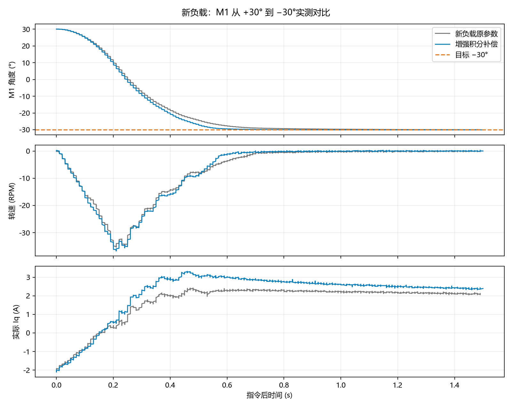

# 新负载双轴调试（2026-10-03）

用户更换负载，并确认 M0 为俯仰、M1 为水平，两轴现在均只有 ±90°行程。编码器、磁铁和三相安装关系未变，沿用原电角度校准。

已将 M0 从多圈改为指令 ±85°、实际行程保护 ±90°；M1 保持相同范围。VOFA 的 M0 输入和滑条已同步为 ±85°，实际安装控件与项目 QML 的 SHA-256 一致；本机配置备份在 `build/gimbal-20261003/new-load/vofa-backup/`。

## 新负载基线

48 RPM（288°/s）、240 RPM/s（1440°/s²）、运动位置 P=8、Iq 限幅 8 A、相电流停机阈值 10 A、硬超速 75 RPM。M0 速度 PI 0.08/0.60、M1 0.12/0.40。

两轴依次通过 0/±3°、±10°/±30°及回零，测试时另一轴保持零位。60°换向进入 ±0.2°：M0 约 0.71 s、M1 约 1.11 s。±30°保持电流约 1.8～2 A，最大给定约 3.18 A，未用满 8 A。用户确认无碰撞、线缆绷紧、明显振动或发热。

## 参数探索

M1 比例增益提高到 0.14 后低惯量模型未稳定，未烧录该参数。随后用 M0 0.10/1.20、M1 0.12/0.80 通过 46 项主机测试并烧录。M0 ±3/±10/±30°独立定位通过，60°换向约 0.55 s；M1 测至 +10°时，M0 交叉保持末 0.5 s 波动跨度 0.319°，超过 0.2°准则，自动停止。单轴提速通过不代表交叉保持通过。

已恢复 M0 比例增益 0.08，将两轴积分增益提升为原来的两倍：M0 速度 PI 0.08/1.20、M1 0.12/0.80。用户重新回中并松手后，该候选已烧录、校验，WARN/TRIP 各 23 项、合计 46 项主机测试通过。运动与保持位置增益、电流环、电流限幅、速度/加速度保持基线设置。

所有动作保留电流、速度、母线、有效角度和 PWM 时序保护；测试结束或异常均发送停止并确认两路状态。原始数据和镜像归档在 `build/gimbal-20261003/new-load/`，机器可读记录见 [JSON](data/gimbal-new-load-20261003.json)。

## 当前固件实测

两轴 ±3°、±10°、±30°、±60°和回零通过，另一轴同时保持零位。M0 ±85°通过；M1 首次 ±85°交叉保持出现一次短暂偏移，按原准则中止，后续同参数、同 4 s 阶段的完整 ±85°往返及回零复测通过。两轴同时反向 ±3°、±10°和回零通过，最大末端误差约 0.02°。

| 通过轮次的实測指标 | M0 俯仰 | M1 水平 |
|---|---|---|
| 最大末端误差 | 0.0256° | 0.0513° |
| 最大末 0.5 s 角度跨度 | 0.0549° | 0.1428° |
| +85→−85°进入 ±0.2° | 1.40 s | 1.06 s |
| Iq 给定峰值 | 7.43 A | 6.42 A |

M1 60°换向由基线约 1.11 s 缩至 0.67 s。M0 当前同动作约 0.76 s，没有证实统一提速；此前 M0 0.10 比例候选虽达到 0.55 s，但另一姿态产生波动，已经收回。每次回中与线缆预紧状态可能改变负载，以上是单次实测，不能将全部差异归因于一个增益参数。

30 s 零位静态保持通过：M0/M1 最大偏差 0.033°/0.022°，末 1 s 跨度 0.044°/0.033°。最初 5°主机局部窗口在启动前发现停机 M1 已偏离 −6.12°，没有启动；恢复零位后以 8°局部窗口记录，固件 ±90°边界和 ±85°目标没有扩大。这次未施加外力，因此不代表新的外力或最大扭矩验收。

### 仍需保留的瞬态记录

用户确认首次 M1 −85°末段未手碰、未移动底座，无明显振动或发热。该阶段 M0 的末 0.5 s 跨度 0.231°、M1 约 0.187°，M0 超过 0.2°准则而停止；不能把后续通过当作已经消除根因。M1 −85°延长至 10 s 保持和回零的末段通过，但回零后约 4.44 s 又短暂偏离 0.231°，随后恢复，最后误差 0.011°。因此不能宣称所有姿态全程保持在 ±0.2°或完全不受负载变化影响；它表现为偶发的慢速负载变化，根因未确定。

本轮到位电流跟随统计大多较好，M1 +85°末端 Iq RMS 跟随误差约 0.10 A。位置和电流均来自板载采样，未作外部角度、电流或扭矩标定；长期温升没有验收。

## 结束状态与交付

最终快照完整核对 Flash 与 BIN 一致，原两轴电角度校准记录有效且未改变，两轴故障与编码器错误均为 0。PWM 更新最大计数 363/81，保留 600 截止保护；原始相电流触发快照全零。两轴 IDLE，TIM1/TIM8 CCER=0x1000/0，输出关闭。停机后结构会自行移动，最终软件角度不代表仍在零位；再次复位前应恢复机械中间位置。

最终 ELF/BIN、参数和对应源码保存在 `build/gimbal-20261003/new-load/firmware-final/`，详见其 `manifest.json`。ELF SHA-256：`0af40b667e01f045bfc327a7832400bede98bda40e552795885101b001337866`。未改变编码器安装编号、校准方向或相线；未提高 8 A 电流给定或 10 A 相电流停机阈值。

采集工具增加 `--paired-opposite`，通过原子双轴指令测试两轴相反角度，并分别核对目标、到位误差、局部窗口与停机。只用于位置测试，不能与另一轴零位保持选项合用。VOFA 控件已同步限位，手动滑条发送的完整界面验收仍保留此前未完成状态。

