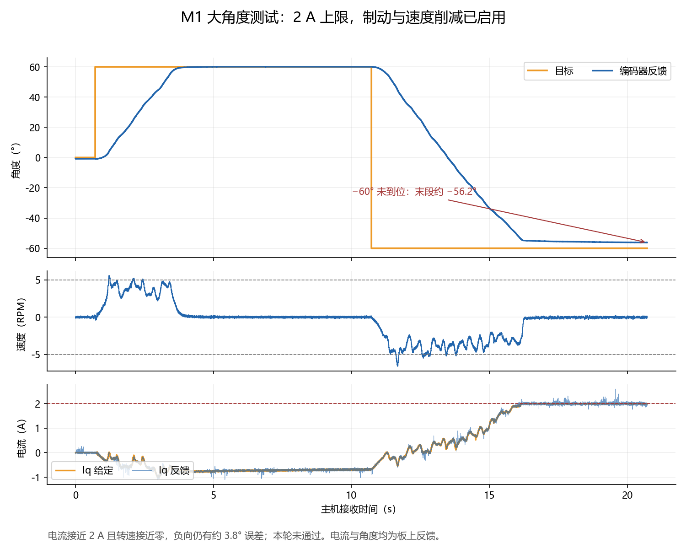
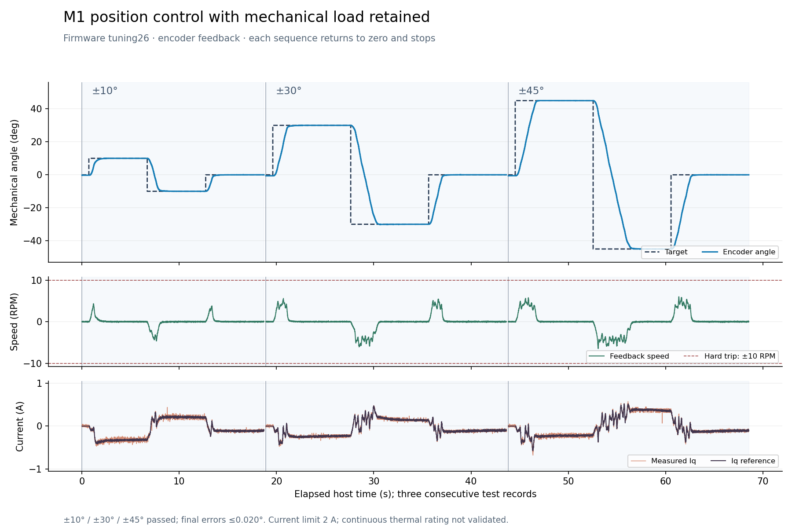
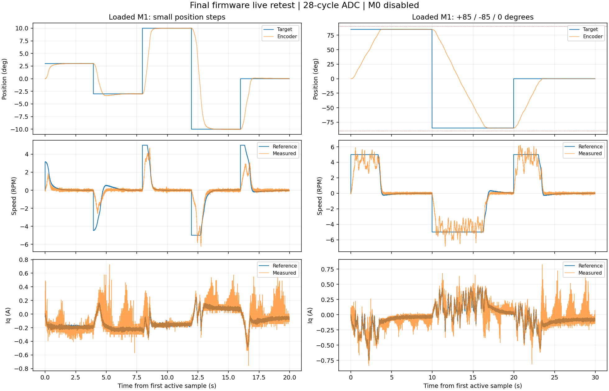

# 双轴云台分环调试（2026-09-30）

本轮目标：从电流、速度到位置逐级调试，增强线缆阻力补偿。用户修正运动范围为 M0 连续多圈、M1 ±90°；M1 命令范围保留 ±85° 及 5° 制动余量。本文记录本轮；此前低增益实验见 [首次实机报告](gimbal-bench-2026-09-30.md)。

**2026-10-01 通道标签更正：启动诊断下标 0 是 SPI3/M1，下标 1 是 SPI1/M0；此前把这组下标当成 USB 的 M0/M1 顺序，说反了异常通道。下文已更正，原始日志不改。详见[编码器交叉检查](encoder-diagnosis-2026-10-01.md)。**

最新状态已更新至 2026-10-01：M0 电机/编码器更换后完成新校准，正常固件 SPI1 为 2.625 MHz，SPI3 为 5.25 MHz，两路长读各 10000 帧通过。已进入双轴带载位置控制复测，见[本日控制测试](gimbal-tuning-2026-10-01.md)。以下保留 9 月 30 日实验数据，不能当作当前镜像的验收记录。

## 软件与保护改动

- M0 取消接线角度限位，保留角度连续展开、编码器合理性、电流、供电和超速保护。M1 独立上电行程中心保持 ±90°，zero/clear 不改变物理中心。
- 增加 itest（≤0.30 A，400 ms）、stest（≤2 RPM，1500 ms）一次性诊断；相对测试开始位置移动 10° 也会停机，重发不能延长时间。field 固定定子电流方向诊断为 0.20 A、250 ms，不写 Flash 校准。
- 固定方向 field 诊断调节定子 d、q 两个电流分量，有四方向 RL 电流跟踪验证。对齐试验中发现摆动，模型验证强制 q 电流为零会抵消反电势阻尼，因此正常校准改回 d 电流调节、q 电压为零；新增生成电流阻尼验证。校准与 field 诊断分别处理，正常位置模式仍使用转子 d/q 电流环。
- 数字转换移出关中断段；目标在两轴 PWM 写入完成后提交，避免目标切换影响采样/PWM 截止时刻。两轴独立排队，stop 会撤销尚未执行的目标。
- 故障后继续更新可信的角度/速度遥测，减少停机后运动被旧数据掩盖的问题。
- 调试器快照先比对板上 Flash 与本地 bin，拒绝用错误 ELF 地址解读 RAM。一次旧板/新 ELF 混用产生的 tuning7-before-swap 快照已排除，不作为证据。

## 早期 M1 电流环记录

保留 Kp=0.20、Ki=192/s、反饱和 1200/s。最终增益下 ±0.10 A 短测末段平均分别 +0.10239、−0.10046 A；电流误差 RMS 为 0.01773、0.02025 A，Id RMS 为 0.03931、0.05292 A。一次性测试自动停机通过。数据：build/gimbal-20260930/tuning13-current/。

电流值来自板上采样比例与偏置，未使用外部电流仪器标定。早期 0.20 A 自由电流试验曾触发超速，因此未做持续转矩试验。

## M1 速度环与位置环

速度 PI 最终增益 Kp=0.16 A/RPM、Ki=0.40 A/(RPM·s)，位置 P 为 1.50 RPM/°；速度滤波 8 ms、轨迹 5 RPM（30°/s）、加速 10 RPM/s。早期 Kp=0.30 出现摆动，Ki=0.60、Kp=0.08 在负载释放后超调较大，均已撤回。

最终速度增益下 ±1 RPM 短测末段分别 +0.92760、−0.96846 RPM，瞬时范围 +向 −0.137～1.086、−向 −2.155～0.155 RPM。短测仅 1.5 秒，末段接近目标，但瞬态仍受重力、线缆和摩擦影响，不能宣称精密恒速已经全部验收。数据：tuning13-speed/。

电流上限逐级调整：0.60 A 在 +20° 附近停在 17.3°；1.00 A 在 +45° 停在 43.2°；1.50 A 曾完成 ±85°，但后续不同起点/负载状态下 −75° 停在约 −70°，实际电流约 1.494 A，约 5° 误差。各轮均已停机，失败记录保留，不能把之前偶然通过等同于全行程可靠。

电压矢量上限曾由母线 10% 提高至 18%，出现约 1.92 A 瞬时读数，已收回至 10%。PC 检查区分瞬时峰值与持续超流，固件继续执行逐相硬停机阈值。

修正位置制动：原来的距离制动速度经过第二次斜率限制，负载释放、实际速度高于轨迹时，降速命令被继续推迟，+45° 可超调超过 5°。现在加速仍渐增，位置制动上限优先于斜率，目标反向时先撤销向旧方向的速度给定。主机新增释放负载以 8.33 RPM 穿入目标点的回归测试。

该修正后、1.50 A 版本实测如下（时间为连续进入 ±0.2° 的时间）：

| 指令 / 起点 | 末段误差 | 时间 | 目标方向超调 |
|---|---:|---:|---:|
| +3° / 近 0° | +0.02124° | 1.01 s | 0.032° |
| -3° / +3° | -0.02124° | 1.63 s | 0.043° |
| +45° / −15° | +0.03296° | 3.07 s | 0.077° |
| -45° / +45° | -0.13184° | 4.29 s | 0.187° |
| +60° / 约 −5° | +0.00732° | 3.33 s | 0.051° |
| -60° / +60° | -0.05127° | 5.65 s | 0.183° |
| +75° / 0° | +0.01465° | 3.14 s | 0.081° |

数据：tuning14-position/、tuning14-large/。最后一轮 −75° 失败见 tuning14-boundary/，随后回零通过（tuning14-return-boundary/）。精度是编码器反馈误差，未用外部角度量具标定。停机后竖直轴会下落，例如快照实测回零停机后 −15.47°，应在物理中间位置支撑至烧录复位完成后再建立中心。

## M0 电气通路诊断

0.60 A/0.60 V 完整双分量校准期间，电流向量峰值约 0.65 A，但起动后突然加速，触发 60 RPM 校准保护；没有保存校准。

原接线固定电流方向：0°、180° 时 α 电流平均约 −0.001、−0.007 A，远低于 ±0.20 A；90° 时 β 平均约 +0.199 A。单纯机械负载/重力通常不能解释施加电压后某个电流方向没有响应。

用户检查接线牢固后，按停机、断电要求交换 M0 A/B 相线。交换后 α 方向有明显电流，电流向量主要沿 α/β 约 30° 方向变化。例如 0° 测试末段 α=0.12686 A、β=0.08062 A；由两相重建的 B 相接近零，异常方向随电机引线交换而变化。这更支持原 A 引线、接头或电机通路问题，尚不能仅凭遥测确定绕组或器件损坏。数据：tuning7-field/、tuning8-field-swapped/。

用户最终测得：电机脱离驱动板后 B-C 为 1.8 Ω，A-B 与 A-C 均超出量程。根据读数，原 A 端到内部电机通路断开；具体引线、接头、焊点或绕组位置还需实物检查。最初“全部约 2.8 MΩ”的读数已由用户更正，不采用。该断路解释了交换线前后电流方向改变以及校准失败，属于电气故障，不能靠增加控制增益修复。

保持 M0 三根相线与驱动板断开，等待修复或替换电机。M0 无有效校准，位置命令被拒绝；M0 电流/速度/位置的实机调试仍未完成。

## 验证与待完成

ARM 固件构建通过；最新真实双路解析/FOC/控制器主机测试 WARN/TRIP 各 15 项，共 30 项，通过。包括释放负载后的制动、双轴目标排队与取消、固定四方向 RL 电流跟踪、校准阻尼、端点停留与起始磁场偏移补偿。单路 M0 回归、双路状态隔离和 Python 语法检查通过。模型不代替实机电流波形、机械精度或热稳定性。

历史 1.50 A / 2.50 A 相保护版本 ELF SHA-256：`c51b3271aa6e616cc39d166c8ea4363faad59a656fd8e388e47a4540f7ecc181`。Flash 与本地 bin 比对一致；调试器快照 tuning14-snapshot/：两轴 state=0、fault=0，dual_fault=0；M0 calibrated=false、M1=true，PWM CCER=[4096,0]，两路输出关闭。

用户实物检查确认无碰撞、无线缆绷紧、无明显发热。随后烧录 2.00 A / 3.00 A 相保护短测候选，电压仍为母线 10%，测试结果见下文。2 A 不是经热稳定性验证的连续额定电流。M0 仍等待 A 端修复，双轴同时控制尚未验收。

2 A 第一版（tuning15-small/）：±3°、±10° 及回零通过，末段误差不超过 0.011°；+60°/−60°/回零通过，但随后 +75° 途中触发超速 11，输出停机。没有执行 ±85°。回零测试 tuning15-return75/ 通过。

增加位置模式速度转矩削减：在快速 FOC 速度估计 5～6 RPM 区间逐渐撤销继续加速的电流，保留制动方向电流；速度 PI 对实际可用输出反饱和，10 RPM 硬保护保持。包括锁定电流负载突然释放、两个方向的回归测试。此版本已烧录并完成下述 tuning16 测试，不能引用前版 ±85° 成功记录作为本版验收。

## 历史速度削减版本实机结果（tuning16）

用户确认当前为中间位置、自然下垂无需支撑并授权直接测试后，完成烧录校验。镜像 ELF SHA-256：`e6c60a6e83c82fd6b5c4fcd924b43694063502034fa2095f925627dd8e053195`，82,636 B，RAM 8,056 B，另 CCM 64 KiB；存档 firmware-tuning16/。

±3°、±10°/回零通过，末段误差不超过 0.031°。+60° 达到 60.0293°，连续进入 ±0.2° 用时约 3.42 s、速度峰值约 5.58 RPM。随后 −60° 在 −56.2061° 卡住，实际 Iq 末段 1.9867 A、给定 2.0 A，转速约 −0.016 RPM，约 3.79° 误差；本轮未通过，未测试 ±75°/±85°。回零通过（tuning16-return60/），之后保持关闭。

四方向 field 诊断（tuning16-field/）电流向量均约 0.2 A；这些通道中的 d/q 是按现有转子电角度投影，不是固定定子诊断方向的 d/q，不能以遥测 iq_ref=0 计算诊断跟踪误差。最后 270° 的定子快照 α=0.03859 A、β=−0.20700 A，符合负 β 电流通路有响应，未见 M0 那样的无电流方向。该检查不代替断电电阻测量或电流探头。

tuning16-field-snapshot/ 已比对 Flash 与 bin，一致；两轴 state=0、fault=0，dual_fault=0，PWM CCER=[4096,0]，两路输出关闭。M0 校准无效、M1 仍使用已有电角度零点 4.400673 rad / 方向 −1。安装后的电角度未重新复核，现请求临时解除 M1 转子负载、保持相线与编码器安装，再校准，以区分电角度偏差与机械转矩需求。电角度偏差尚未确认，不能据此认定记录错误。

当前仅小角度与 +60° 通过；全行程可靠性、长时间温升与双轴同时定位均未完成。待物理处理期间不自动启动、不提高限位、不清除保护。

用户当时回复解除 M1 负载、回中恢复供电后，尝试复位校准，但启动传感器检查失败，无校准命令执行。快照 unloaded-connection-snapshot/：dual_init_crc_valid=1 实际表示 SPI3/M1 有效、SPI1/M0 无效，SPI1/M0 状态与安全字均 FFFF；两轴 fault=1、dual_fault=1、PWM 输出关闭。此前据此请求用户重新接回 M1 编码器的通道依据错误；用户处理接线后整体通信恢复，不能将恢复原因单独归到 M1。RAM calibrated=false 是初始化未完成，不说明 Flash 记录丢失。用户随后澄清负载从未取下，这些测试均为带载，unloaded 目录名保留供追溯。

## 保留负载的重新校准与小角度复测（tuning26）

校准修改：正常校准调节 d 电流、q 电压为零，利用反电势产生的横向电流阻尼；固定 field 诊断保留完整两分量电流调节。M1 校准限速 30 RPM，field 和正常运行仍限 10 RPM，±90° 行程保护始终保留。扫描仍为 4 秒一电角周，增加正向端点停留 1 秒，反向返回后等待 1 秒再采样 0.2 秒。有效旧校准仅用于选择靠近当前位置的起始磁场，避免从任意角度跳到零电角；新记录用实测方向、稳定后的编码器角度求得，并减去磁场起始偏移。主机用与旧记录相反的模拟运动方向验证偏移补偿，不把旧方向直接写回作为新结果。

失败实验均未保存：原 10 RPM 校准在初始对齐超速；30 RPM、0.45 A 在正扫结束测得 −40.671°，低于允许的约 −41.143°；增加端点停留后仍有磁极跳动。0.12 V 开环电压不足以完成一个机械极距，0.25 V 从固定电角起步触发超速；以旧记录选择近处磁场后开环出现 1.229 A 单帧，PC 停机。恢复电流调节后 0.45 A 完成往返，但约 1.2° 返回差超出 1° 标准。因此最终采用 M1 0.60 A / 0.30 V，保留近处起始磁场、端点停留和 30 RPM 校准保护，未放宽位移与返回一致性标准。

unloaded-v26-cal/：完成完整往返。正向位移 −44.0552°，方向 −1；最后采样时位置约 2.944°、初始对齐点约 2.955°，返回差约 −0.011°，通过一致性检查。新零点 4.04012585 rad，与旧 4.40067339 rad 相差 −0.360548 rad（约 −20.7° 电角、对应约 2.95° 机械角）。这确认零点有差异；由于实际机械负载始终保留，差异也可能来自对齐时的负载偏移，不能视为无负载电角度精确标定，尚不能证明此前带载卡住已解决。

保存校准时 MCU 擦写 Flash，遥测停止约 1 秒，旧 PC 工具的 0.5 秒超时将该轮标为失败；该日志保留，不按 PC passed 字段认定校准结果。固件保存后已通过 Flash 自校验，调试器再次读取原始记录：版本 5、方向 −1、零点 4.04012585、校验和有效，M1 state=0/fault=0。快照 unloaded-v26-record-snapshot/。M0 在保存后的采样重启出现单轴 sensor=1，静止 clear 后恢复；没有对 M0 施加电流。采集工具已限定只在校准预计完成的窗口允许最多 2 秒遥测间隙，其余阶段仍为 0.5 秒，校准总采集等待 15 秒。

当前 ELF SHA-256：`bd48ec8f4d0e1a590e5e25bcebb2b5dfb51c1d02d53e372b4214188c6b435fce`，Flash 83,420 B、RAM 8,064 B、另 CCM 64 KiB。下载校验及 Flash/bin 比对一致，校准记录与代码区分别验证。正常控制参数仍为 2 A、速度 PI 0.16/0.40、位置 P 1.50、5 RPM 轨迹及快速速度削减；2 A 仅作为当前短测上限。

新校准电流短测（unloaded-v26-current/）：±0.10 A 末段均值分别 +0.09696、−0.09744 A，电流误差 RMS 0.02109、0.01777 A，Id RMS 0.03600、0.04273 A，固件定时停机通过。速度短测（unloaded-v26-speed/）±1 RPM 的末段均值为 +0.50988、−0.99208 RPM；正向未充分跟随，因此不能将无保护故障的诊断完成视作恒速验收。工具现增加末段速度误差判据（20% 或 0.1 RPM），避免只报告命令完成就标为精度通过。该 1.5 秒诊断不足以确定连续恒速性能。

带载位置结果如下，末段精度仅为板上编码器反馈，不含外部量具标定：

| 目标 / 起点 | 末段误差 | 连续进入 ±0.2° 的时间 |
|---|---:|---:|
| +3° / +2.63° | +0.01025° | 0.15 s |
| −3° / +3° | +0.00073° | 1.31 s |
| 0° / −3° | 0.00000° | 1.27 s |
| +10° / 约 −0.26° | +0.00854° | 1.37 s |
| −10° / +10° | −0.01953° | 1.77 s |
| 0° / −10° | +0.01099° | 1.27 s |

数据：unloaded-v26-small/、unloaded-v26-ten/。各点末 0.5 秒的位置范围均小于 0.05°，实际速度最大约 4.67 RPM，没有电流、转速或行程故障；最后 stop 确认。负载未拆除，继续用同一上电行程中心进行分级带载复测。M0 相线继续断开。

进一步分级带载测试如下，沿用相同行程中心，期间没有复位或清零：

| 目标 / 起点 | 末段误差 | 连续进入 ±0.2° 的时间 | 目标方向超调 | 末段 Iq 均值 |
|---|---:|---:|---:|---:|
| +30° / 约 −0.62° | +0.00366° | 2.14 s | 0.026° | −0.227 A |
| −30° / +30° | −0.01465° | 2.81 s | 0.114° | +0.140 A |
| 0° / −30° | +0.01099° | 1.80 s | 0.033° | −0.098 A |
| +45° / 约 −0.56° | +0.01099° | 2.22 s | 0.055° | −0.213 A |
| −45° / +45° | −0.01099° | 4.24 s | 0.044° | +0.357 A |
| 0° / −45° | 0.00000° | 2.39 s | 0.044° | −0.105 A |

数据：loaded-v26-thirty/、loaded-v26-fortyfive/。末 0.5 秒角度范围均小于 0.05°，反馈转速峰值约 6.47 RPM、无保护故障，两轮结束均确认 stop。保持电流明显低于此前部分大角度试验，但软件起点与接线作用力也可能不同，不能仅归因于零点调整。测试接近 ±85° 前，需要确认真实中间位置以建立正确行程中心；不通过反复复位扩大接线可用范围。

收到“继续”后，为边缘测试复位，尚未下发新目标。快照 loaded-v26-powercycle-snapshot/：SPI3/M1 状态 0x8000、安全字 0xFE2A，SPI1/M0 状态和安全字均 FFFF；dual_init_crc_valid=1、dual_fault=1，两路输出关闭。此前报告“M0 正常、M1 无应答”说反了。硬件复位和用户重接供电后仍相同。已读到的 SPI3 0x0B55、PC10/11/12 AF6、PA0 高电平属于有应答的 M1 通道，不能用于证明异常的 M0/SPI1 接口配置正常。

原始 Flash 新校准仍有效，RAM calibrated=false 因初始化在加载记录前失败。此前请求测量 M1 编码器电源，异常通道依据错误；启动阻塞实际来自 M0/SPI1。不能把启动失败归因于位置增益或记录丢失。

用户随后要求重新测试，整体通信恢复，物理原因未确认。loaded-v26-recovered-snapshot/：M1 RAM 加载零点 4.04012585 rad / 方向 −1，双方 fault=0、dual_init_crc_valid=3、输出关闭。M1 停机位置约 −13.58°，保留该中心完成后续 ±60° 测试，没有再次复位或扩大限位。首次初始化掩码 1 表示当时 M0/SPI1 校验失败后恢复，应关注该通道连接可靠性。

## 同一中心的全行程带载复测

下面各轮沿用通信恢复后的上电中心，不复位、不清零；命令之间持续位置控制。每轮回零后停机确认，下一轮起点受自然下垂影响。

| 目标 / 起点 | 末段误差 | 连续进入 ±0.2° 时间 | 目标方向超调 |
|---|---:|---:|---:|
| +60° / 约 −13.59° | +0.00732° | 3.96 s | 0.249° |
| −60° / +60° | −0.00732° | 5.18 s | 0.029° |
| +75° / 约 −0.81° | +0.01465° | 3.62 s | 0.092° |
| −75° / +75° | −0.01465° | 6.53 s | 0.048° |
| +85° / 约 −0.91° | +0.01221° | 3.87 s | 0.122° |
| −85° / +85° | −0.00122° | 7.03 s | 0.188° |
| −85° / 约 −0.94°，重复 | −0.00122° | 3.90 s | 0.199° |
| +85° / −85°，重复 | +0.01221° | 6.96 s | 0.155° |

数据：loaded-v26-sixty/、loaded-v26-seventyfive/、loaded-v26-eightyfive/、loaded-v26-repeat-boundary/，均 passed=true、stop_confirmed=true，无固件故障。各轮回零最终误差不超过 0.011°，最大运动速度约 6.96 RPM，低于 10 RPM 硬保护；170° 移动时间受 5 RPM 轨迹限制。±85° 两轮往返边缘超调最大约 0.20°，未触及 ±90°。这是当前装配的短时定位结果，不是电流计量、绝对角度或长期可靠性证明。

## 电流与低速复核、采样对照

loaded-v26-final-current/：±0.10 A 末段均值为 +0.12672、−0.08747 A，误差 RMS 为 0.13661、0.06599 A，超过工具新增的 RMS ≤0.05 A 判据。该旧日志的 passed=true 仅表示诊断完成并定时停机，不能作为电流精度通过。新工具区分 diagnostic_completed 与精度 passed，并检查末段均值误差 ≤max(0.02 A,20%)、RMS ≤max(0.05 A,20%)。

M0 相线断开时，其表观 Id 波动与 M1 电流误差同步，正电流测试相关系数约 −0.895，母线电压相关性较弱。这支持共同的采样或模拟电路干扰这一待查方向，不能据此确定参考电源、接地或某个器件故障，也没有用软件扣除 M0 读数来掩盖问题。没有外部电流波形或编码器端供电测量。

loaded-v26-final-speed/ 先被旧 PC 工具判为超速，但发生在固件 1.5 秒诊断结束、驱动关闭后的重力下落；固件没有超速故障。采集工具现始终保留行程、电流和母线检查，仅对驱动活动期间执行速度检查，单独记录 coast_rpm_peak，且下一次命令前仍要求轴速度低于 5 RPM。修正后 loaded-v26-speed-coast-separated/ 的 ±1 RPM 末段均值为 +0.77583、−0.68719 RPM，均未达到 20% 或 0.1 RPM 判据；diagnostic_completed=true、passed=false。带电瞬时范围约 −0.202～+0.990 RPM、−2.590～+0.117 RPM；停机下落最大约 9.82 RPM。不能宣称电流环与低速恒速精度均已验收。

tuning27 对照试验只将两路电流 ADC 采样由 28 延长为 56 周期，同时将两注入通道有效采样窗由 640 改为 992 个计时器刻度；控制增益、限幅及保护不变。构建及 30 项主机测试通过。loaded-v27-current/ 的 +0.10 A 实测约 176 ms 后触发固件超速 11，输出关闭，没有完成负向电流测试。loaded-v27-small/ 的 ±3°、±10°、回零均到位，但部分末段 Iq RMS 仍为 0.055/0.087 A，未发现明确改善。因此撤回该采样实验，恢复 28 周期及 640 刻度窗口；不增加电流或速度上限掩盖异常。

## 最终固件烧录与带载复核（tuning28，恢复 tuning26 配置）

最终 ELF SHA-256 为 `bd48ec8f4d0e1a590e5e25bcebb2b5dfb51c1d02d53e372b4214188c6b435fce`，bin SHA-256 为 `8b465806867bedbafaa152936e79ba9d4249bbdc7484c9db5ed88709bd5312e5`；恢复后与 tuning26 镜像一致。存档 build/gimbal-20260930/firmware-final/ 包含 ELF、bin 和 manifest.json。只擦写代码区 0～4 扇区，保留第 11 扇区校准；下载校验通过。最终构建和 30 项主机测试通过，采集工具 Python 语法检查通过。

| 最终目标 / 起点 | 末段反馈误差 | 连续进入 ±0.2° 时间 |
|---|---:|---:|
| +3° / 约 0° | +0.01025° | 0.84 s |
| −3° / +3° | +0.00073° | 1.71 s |
| +10° / −3° | +0.01953° | 0.89 s |
| −10° / +10° | −0.03052° | 1.50 s |
| 0° / −10° | +0.01099° | 0.90 s |
| +85° / 约 −0.13° | +0.01221° | 3.75 s |
| −85° / +85° | −0.02319° | 7.45 s |
| 0° / −85° | −0.01099° | 3.55 s |

数据：loaded-v28-small/、loaded-v28-boundary/，均 passed=true、stop_confirmed=true。各点末 0.5 秒角度范围不超过 0.044°；边缘超调最大约 0.221°，±3° 中负向超调约 0.362°后收敛。实际速度峰值约 6.86 RPM，低于硬保护。不同起点的 10° 小步响应时间并不等同于从 0° 发出 10°的时间，表中保留实际起点。保持电流和速度存在噪声，不能据此宣称动态响应完全无振动。

final-snapshot/：代码与 bin 一致、M1 新校准有效，两轴 fault=0、PWM 输出关闭，M0 无有效校准。first_crc_valid=1、init_crc_valid=3、encoder_errors=[0,1] 使用 SPI3/SPI1 顺序，实际说明 M0/SPI1 首次校验失败并有一次错误后恢复，此前标成 M1 是标签错误。

后续实物工作：修复或更换 M0 后重新校准，复核异常 SPI1/M0 通道及电流采样共同干扰。2 A 只是短测上限，无温升验收；本轮结束两路输出关闭。

## 用户报修复后的 M0 再次检查

用户要求检查 M0 是否可用，并回复“已修复并接好”，没有提供新的三组电阻读数。先确认编码器有效、两轴无故障且 PWM 输出关闭；M0 仍无有效电角度校准。然后保持 M1 关闭，执行 M0 0°/90°/180°/270° 固定定子方向电流短测，每次 0.20 A、250 ms；没有进行完整校准或位置控制。

| 固定方向 | 末段电流向量幅值均值 | 对 0.20 A 的误差 RMS | 幅值检查 |
|---|---:|---:|---|
| 0° | 0.03738 A | 0.18218 A | 不通过 |
| 90° | 0.20171 A | 0.01676 A | 通过 |
| 180° | 0.02120 A | 0.17991 A | 不通过 |
| 270° | 0.20537 A | 0.03335 A | 通过 |

数据：m0-repaired-field/。0°/180° 两个方向明显缺少电流，90°/270° 正负方向有响应，与此前 A 端通路异常表现相似；尚不能据此判断是修复后的电机引线、接头还是驱动 A 相故障。未提高电流或进行自动校准。采集器原来的 field passed 只说明诊断按时完成，原始记录保留；新增 field-analysis.json 明确幅值检查失败。工具现将 field 幅值均值误差 ≤0.04 A、误差 RMS ≤0.05 A 纳入 passed，区分诊断完成与电流响应合格。幅值通过不等于方向或转矩精度完整验收。

m0-repaired-field-snapshot/ 确认代码镜像一致、两轴 state=0/fault=0、PWM CCER=[4096,0]、outputs_off=true，M0 仍 calibrated=false。最后 270° 定子快照 α≈−0.00694 A、β≈−0.22278 A。当前判断为 **M0 尚不能用于正常位置控制**；已要求断开功率电源、将 M0 电机与板分离后复测 A–B/A–C/B–C，并说明修复部位和供电状态，待实际读数区分故障位置。

## 更换新 M0 后的启动检查

用户报告已更换新电机、相间电阻正常，并确认仍为 ZH3620-1（7 极对）、编码器及磁铁已安装。尚未收到新电机的具体三组电阻值，不能将旧电机的断路测量直接用于判断新电机。

新电机四方向诊断在初始采集即超时，未发送 field 命令。m0-newmotor-startup-snapshot/、m0-newmotor-reset-snapshot/：SPI3/M1 状态 0x8000、安全字 0xFE2A；SPI1/M0 状态和安全字 FFFF，初始化 5 次失败，dual_init_crc_valid=1。两轴 SENSOR 停机、输出关闭，M1 Flash 校准有效。此前将有应答和无应答的电机标签说反了。

此前因标签误判要求用户重接 M1、测 M1 电源，未得到电压值且启动未恢复。m0-newmotor-reconnected-status.json 的真实异常通道仍是 SPI1/M0。新电机通电、校准及位置测试均未执行；没有得出其损坏或已可用的结论，也没有屏蔽故障启动电机。

采集工具修正了 USB 停机写超时掩盖初始故障、导致 JSON 丢失的问题：现在始终关闭串口并保存初始错误和 cleanup_errors；无法得到停机遥测时 stop_confirmed=false，不冒充已确认。成功测试若停机无法确认，也会改为失败。模拟初始遥测失败及两次清理写超时的回归检查通过；本次硬件关闭状态由调试器独立确认。新记录见 m0-newmotor-field-reconnected/、m0-newmotor-field-repowered-reset/。

用户要求再次测试后的两次重试均 0 帧、无 field 执行。m0-newmotor-retry-snapshot/ 再次确认实际为 SPI3/M1 有效、SPI1/M0 FFFF，两轴 SENSOR 停机、输出关闭；M1 Flash 校准仍有效。该记录也已更正标签，不能用于判断新 M0 电流或位置是否合格。
