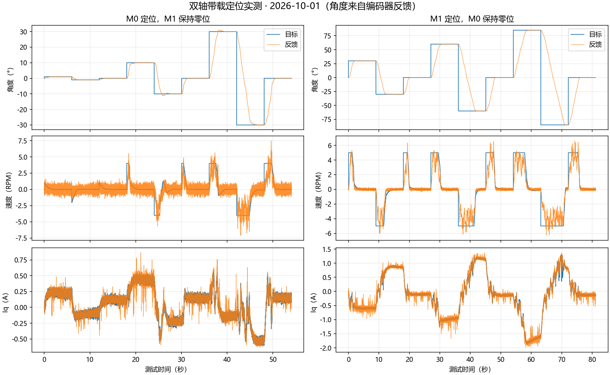

# 云台控制测试（2026-10-01）

M0 已更换同型号 ZH3620-1 电机及编码器，相电阻经用户确认正常；M1 原编码器/磁铁安装关系已恢复。M0 接线允许连续多圈，M1 命令 ±85°、上电中心实际停机边界 ±90°。所有定位误差取板上编码器反馈，不代表外部角度标定精度。

## 通信与校准

双路接线恢复后的通信诊断 `build/gimbal-20261001/new-m0-encoder-dual-reconnected/`：SPI1 2.625 MHz、SPI3 5.25 MHz，各 10000/10000 CRC 和有效角度通过。M0 的 5.25 MHz 对照仍失败，正常固件因此采用较低的 SPI1 速率；片选独立、顺序读取，安全字/传感器编号与 CRC 检查保留。具体硬件原因仍未由信号仪器确定。

新 M0 四方向定子 0.20 A 短测均通过，均值 0.182～0.206 A、幅值 RMS 误差 0.015～0.046 A。电流环 ±0.10 A 测试均值 +0.10124/−0.10547 A，跟随 RMS 0.02676/0.02890 A。记录分别为 `new-m0-field-four/`、`m0-repositioned-current/`。

M0 校准记录已成功保存并由复位后固件加载：版本 5、安装身份 571539463、零点 1.652138233 rad、方向 +1、校验有效。正向扫角 44.3298° 通过现有 7 极对的 0.8～1.2 位移检查，未据此更改极对数。**校准整轮工具仍报失败**：Flash 保存、输出关闭后的采样间隙结束时触发 SENSOR，编码器通信错误计数为零；疑似停机运动跨越采样间隙，未修复或证明根因。不能把有效 Flash 记录等同于校准全流程无故障。后续均在复位加载该记录后测试。

M1 保留原有效校准：零点 4.040125847 rad、方向 −1、身份 303169543。用户明确确认模块及磁铁已恢复上次定位成功时的安装关系，没有重新写入 M1 校准。

## 控制参数与保护

| 参数 | M0 | M1 |
|---|---:|---:|
| 位置 P（RPM/°） | 1.00 | 1.50 |
| 速度 P（A/RPM） | 0.08 | 0.16 |
| 速度 I（A/(RPM·s)） | 0.60 | 0.40 |
| 外环速度滤波 | 1 ms | 8 ms |
| 最大轨迹速度 | 4 RPM / 24°/s | 5 RPM / 30°/s |
| Iq 上限 | 0.60 A | 2.00 A |
| 相电流停机阈值 | 1.50 A | 3.00 A |
| 运行硬超速停机 | 10 RPM | 10 RPM |

电流 PI 保持 Kp=0.20、Ki=192/s。速度积分提高到 0.60 后，M0 ±1° 的静态误差得到消除。速度 P 从 0.08 提高到 0.12 的对照出现振荡和 −1° 跟随失败，已撤回；没有保留失败参数。

原 5 RPM 轨迹的 M0 ±30° 往返能定位，但实测负向速度峰值 9.75 RPM 接近硬保护。最终改为 4 RPM：超过 4～5 RPM 削减加速电流，超过 5 RPM 以 0.20 A/RPM 建立反向制动，最多 0.60 A，保留更强的正常 PI 制动。该覆盖用于位置模式，电流/速度短诊断不受其替代。外环反饱和按实际可用输出更新。M1 原削减逻辑保持。硬停机阈值从“轨迹速度的两倍”拆为独立 10 RPM，避免更改轨迹速度同时改变保护。

首次 +30° 的超速停机，用户确认有手碰/移动结构，保留原始日志，排除其用于无干扰稳定性验收。另一轮 4 RPM 配置曾因旧的倍数定义在约 8 RPM 停机；上述独立保护已修正。主动制动方案的 M0 独立 ±1°、±10°、±30° 与回零全部通过，末端最大误差 0.02197°，最后 0.5 秒跨度不超过 0.06592°，进入 ±0.2° 需 0.68～3.67 秒，最大实际速度约 7 RPM。该轮为 `m0-active-braking-position/`，采样触发仍为早期版本，后续双轴复测另记。

## 计算时序修复

停机 `stop` 短暂屏蔽中断时，旧代码曾在两轴 IDLE/OFF 下因 TIM8 更新计数 661 > 600 触发 TIMING，导致遥测停止。仅将已禁止、已关闭栅极的桥提前返回；所有已使能、预充电及 PWM 运行仍执行原截止检查。修复后 200 次停机指令、5409 帧遥测无故障，见 `idle-stop-stress/`。

M1 启动以及双轴运行又发现真实的 M1 PWM 写入超时。修复包括：先完成两轴电流环与 PWM 写入，再执行两轴 1 kHz 外环；单个 SPI 字使用当前选中通道直接传输，保留 TXE/RXNE/BSY、超时、CS 等待、CRC 及传感器检查；双路 ADC 触发提前至计数 4000。`foc_modulate()` 原有共模偏移使所有相位边沿留在有效静稳窗口内，不改变线电压；启动零矢量的三相相等占空比也按同一窗口选择。第一版遗漏保持阶段固定 50% 的赋值，窗口保护拦截启动，补齐后 30 项主机测试通过。没有放宽 600 计数的写入/更新截止或 ADC 静稳窗口。

新增 `dual_write_counter_min[2]`、`dual_update_counter_max[2]`，顺序为 M0/M1，用于实测运行时间余量；其采样点在截止判断前，须扣除记录本身到判断的开销。编码器诊断数组仍按 SPI3/M1、SPI1/M0 排列，勿与这组电机顺序混淆。快照工具保存这些量及实际定时故障现场。

M1 在触发 5600 的中间版本，独立 ±1°、±10°、±30° 与回零通过，末端最大误差 0.02197°，进入 ±0.2° 需 1.17～4.13 秒；见 `m1-earlier-adc-position-small/`、`m1-earlier-adc-position-medium/`。最终双轴版本的结果见后续验收记录。

## 验收范围

最终配置（触发 4000、窗口内零矢量、M0 I=0.60）的双轴通电结果：

| 实机项目 | 最大末端角度误差 | 最后 0.5 秒最大跨度 | 进入 ±0.2° 所需时间 | 结果 |
|---|---:|---:|---:|---|
| M0 ±1°、±10°、±30° 往返及回零，M1 保持零位 | 0.07324° | 0.06592° | 0.89～4.25 s | 通过 |
| M1 ±30°、±60°、±85° 往返及回零，M0 保持零位 | 0.11108° | 0.04395° | 2.16～8.04 s | 通过 |
| 双轴同时定位 (3°,−3°)、(−3°,3°)、(0°,0°) | M0 0.03223° / M1 0.01099° | 0.06592° / 0.05493° | 每段观测 5 s | 通过 |

M1 +85° 到 −85° 的 170° 运动，约 8.04 秒进入 ±0.2°；实测最远 −85.144°、+85.122°，未触及 ±90° 边界。两轴一动一保持时，保持轴末端误差最大 0.02197°（M1）/0.01099°（M0）。M0/M1 最大实际速度分别 7.50/6.64 RPM，无故障、无主动加大电流上限。对应原始记录为 `dual-trigger4000-zero-fit-m0-move-m1-hold/`、`dual-trigger4000-m1-move-m0-hold/`、`dual-simultaneous-small/`。

最终电流 ±0.10 A 复测通过：均值 +0.101662/−0.098321 A，RMS 误差 0.02598/0.02013 A，见 `final-m0-current/`。独立 ±0.5 RPM、1.5 秒速度短测未通过：末段均值 +0.39205/−0.23699 RPM，见 `final-m0-speed/`。M0 速度 I=0.90 的对照也未改善（+0.29460/−0.24467 RPM），已恢复所有双轴定位验证使用的 I=0.60，未保留未验收的增益。

最终重新烧录、下载校验通过，随后双轴回零与关闭输出通过。`final-stopped-snapshot/` 核对完整 Flash/bin 一致、两轴 state=IDLE/fault=0、共用故障 0、两路编码器累计错误 0、ANGLE/启动有效掩码 3、两份校准记录均有效，TIM1/TIM8 CCER=[4096,0]，两路电机栅极关闭。停机后无支撑轴仍可能自然移动；回零是在关闭输出前验证的。

最后这轮回零复测的 PWM 写入最小计数为 M0 3579、M1 1719，更新最大计数为 201、79，均满足截止检查。写入最小计数采样到实际判断约 58 周期，M1 仍有约 6.3 µs 余量；**这些计数仅覆盖最后回零复测，复位前的大行程时序计数未保存**。串行读取最长 5803 周期，约 34.54 µs。无主动放宽截止门槛。

最终 ELF SHA-256：`123d0c0fee0795d2d6b976c7bb4e66c8cae87d7661df1c9d52c26fe129b390d4`；bin SHA-256：`b185d895eaff9026dd2cef9913048e61f7b53e01af68ebdd98544ef01b0ea4be`。Flash 83,580 B、RAM 8,080 B、CCM 64 KiB。存档 `build/gimbal-20261001/firmware-final/` 含镜像、清单、源文件哈希与最终快照。最终 ARM 编译、WARN/TRIP 各 15 项主机测试（共 30 项）、采集工具语法检查及差异空白检查通过。

当前测试为短时带载定位。M0 −0.5 RPM、1.5 秒的速度短测末段均值 −0.2294 RPM 未达到跟随标准，不能宣称独立速度环全部验收；位置保持依靠较长的积分建立负载转矩。电流采样存在噪声、校准保存后的故障未解决，未做长期温升、外部电流/角度标定或 IMU 姿态稳定测试。

`gimbal_tune.py --hold-other-zero` 用于验证一轴移动、另一轴闭环保持零位，两个轴均需满足误差与末段跨度 ≤0.2°；结束和异常均发送 `stop`，遥测失效时另用 SWD 确认两路栅极关闭。原始结果与 CSV 均保存在 `build/gimbal-20261001/`。
