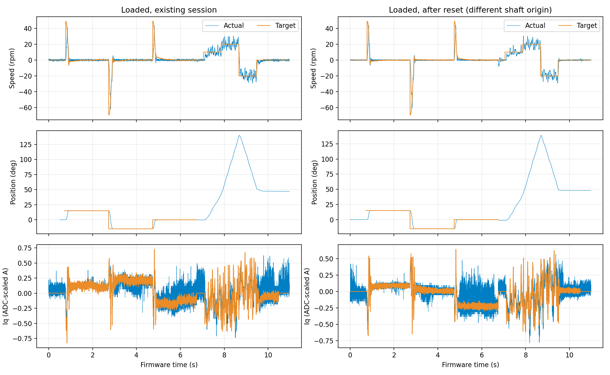

# 塑料臂负载评估（2026-09-27）

## 结论

安装塑料臂后，电机能够完成低速正反转与小角度定位，响应速度仍较快，静止保持较好；**低速匀速性和定位超调仍需改善**。本轮只测现有固件，没有修改参数、烧录新程序或重新执行电气对齐。

先在原运行会话测试，再通过 ST-Link 复位，使用相同命令序列复测。两轮末尾均发送 `stop`，遥测确认待机、故障 0、命令拒绝 0。复位与软件 `zero` 改变了本次位置零点；之后的 `pos` 均相对于新软件零点。

负载目前只知道是塑料臂，质量、长度、重心、轴的朝向和安装刚度尚不明确。这是当前机构的短测，不是已知转矩/惯量的负载标定。没有测试外力扰动恢复、长时间温升或负载能力上限。

## 测试方式与实测

- 定位：`pos 15`、`pos -15`、`pos 0`，每点保持约 2 秒。
- 速度：10、20、−20 rpm，每段约 0.8 秒，随后 `rpm 0` 约 1 秒并停机。
- 定位到达：进入 ±0.5°，随后连续保持至少 100 ms。
- 末段统计：定位取最后约 0.5 秒；速度取最后约 0.5 秒，因测试较短，不能视为长时间稳态。
- 电流均为板上换算的 Iq/Id，尚无独立电流标定；角度来自板载编码器。

以下为复位后的复测结果：

| 测试 | 末段平均值 | 末段标准差 | 其他表现 |
|---|---:|---:|---|
| 定位 +15° | 14.9994° | 0.0069° | 到达 0.144 s，超调 0.590° |
| 定位 −15° | −15.0039° | 0.0062° | 到达 0.169 s，超调 0.458° |
| 定位 0° | −0.0015° | 0.0083° | 到达 0.151 s，超调 0.022° |
| 10 rpm | 10.171 rpm | 3.038 rpm | 峰峰值 14.40 rpm |
| 20 rpm | 19.828 rpm | 3.998 rpm | 峰峰值 16.58 rpm |
| −20 rpm | −19.861 rpm | 4.052 rpm | 峰峰值 18.06 rpm |

20 → −20 rpm 的变化达到 90% 约需 0.061 秒。速度计算使用 20 ms 尾随平均；这个指标只说明反向快，不表示转速已经稳定。±20 rpm 在本次 0.8 秒段内没有满足“20 ms 平均速度进入 ±3 rpm 并保持 100 ms”的判定。

位置保持时末段均值误差不超过约 0.004°、标准差约 0.006–0.008°。这些是内部反馈统计，不能当成外部绝对精度。与之前空载报告的小角度最大超调约 0.10° 相比，本轮约 0.59°，提示带载后制动/阻尼需要重新匹配；两轮条件与初始角度不同，不能给出严格的负载增加百分比。

图左为原会话，图右为复位后；位置图排除了测试前 `zero` 的大角度跳变，并只在位置模式绘制位置目标。速度模式下位置随转动增长，属于正常行为。

## 电流、供电和日志

复测母线平均约 12.00 V、最低约 11.87 V，运动段电压可用比例没有出现小于 0.999 的记录。原会话仅有约一个点缩放。因而本次低速波动**没有明显的电压饱和证据**；也没有检测到故障或命令拒绝，继续提高供电电压缺少本轮依据。

复测最大目标 Iq 约 0.68 A；±20 rpm 末段平均实际 Iq 分别约 −0.15/+0.11 A（电气与机械方向映射会改变符号）。运动中目标与实际 Iq 的 RMS 差约 0.15 A，定位保持时约 0.025–0.091 A。该差同时包含目标变化后的跟随滞后、采样噪声和零点残差，不能直接判定是电流 PI 太弱。

目标 Id 为 0，而定位 +15° 的实际 Id RMS 约 0.11 A，其余工况也存在残差。应进一步按转子角度检查零点、电角度对齐、采样偏差和电流环跟随，而不是马上增加 PI 增益。

原会话记录 27,425 帧，3 次跳步共缺 6 点；复测 27,443 帧，3 次跳步共缺 9 点。正常相邻时间 400 us，对应 2.5 kHz 遥测。少量日志缺点仍存在，仅凭这些缺点不能证明控制环漏执行。

## 发现的代码问题：累计角度过大后精度下降

测试前软件位置约 108,425°。`App/FOC/foc.c` 用 `static float position` 累加每次编码器增量；`control_step()` 又对这个累计浮点角度做预滤波和差分。

float32 在此数量级相邻可表示数相差 **0.0078125°**。10 rpm 在 10 kHz 采样下，每次平均只转 **0.0006°**，比上述步长小。实际编码器增量虽有量化，但在大数上逐次相加仍会产生额外舍入，预滤波的小修正也可能丢失。`zero` 只清除外环软件位置，不清除 FOC 内部累计角度，因此不能从根本上消除这个问题。

复位后定位反馈标准差下降，速度波动仍存在。**这不是严格的单因素 A/B**：复位也重测电流零点，塑料臂的绝对初始角度与软件零点发生变化。因此不能把全部改善归因于浮点精度；但数值表示的问题本身可从代码和 float32 分辨率确认。

## 建议改进顺序

### 1. 先修复位置表示与速度估计的输入

将编码器原始单圈角度、圈数和软件零点分开保存。圈数使用整数，局部单圈角度保留 float；速度估计使用每次经跨圈修正后的角度增量，避免先加到十万度大数再相减。位置规划也尽量用局部目标误差计算，长期连续位置另行表示。

接口层应输出统一的角度增量/时间，外环不依赖具体编码器驱动。不要只在 VOFA 显示时做取模，也不要每次软件置零后要求用户复位。修正后先做静止、连续多圈、跨 0°/360° 和回到原点的验证，确认速度和位置无跳变。

### 2. 把低速波动分解为反馈误差与真实机械波动

在相同绝对轴角度、相同电流零点下重复短测，同步记录原始角度、角度增量、外环速度、Id/Iq 和电流 PI 输出。必要时用录像或其他独立测速判断塑料臂是否真的周期性加减速。

目前速度波动在加塑料臂前也存在，不能全部归因于新增负载。编码器磁铁偏心、齿槽转矩、速度估计量化、环路振荡和机构柔性都仍是待区分的候选原因，现有短记录不能唯一定位。

### 3. 再匹配带载速度环阻尼与电流跟随

数值输入稳定后，在固定工况做 Kp/Ki 的单参数对照，比较速度波动、超调、响应时间和 Iq RMS 差。已有速度 Kp=0.06、Ki=0.24 是空载参数，不能直接认定适合塑料臂。

不应依据平均速度接近目标就提高 Ki；也不能未经对照就认定降低 Kp 一定更好。先查约 0.15 A 的动态 Iq 差中，跟随延迟与噪声各占多少，保证电流环能跟随外环请求。

### 4. 最后改轨迹和负载补偿

当前位置加速度 600 rpm/s、制动参数 480 rpm/s。塑料臂增加惯量或柔性后，可先对照降低制动参数（更早减速），评估能否减少约 0.59° 超调，再加入加速度连续变化的轨迹，减少突变激励。平滑轨迹的原理可参考 [ST AN5464](https://www.st.com/resource/en/application_note/an5464-position-control-of-a-threephase-permanent-magnet-motor-using-xcubemcsdk-or-xcubemcsdkful-stmicroelectronics.pdf)，本项目采用自己的三级控制实现。

若轴水平、塑料臂在竖直平面运动，重力转矩随角度变化，可以在知道质量、重心和安装方向后标定重力前馈；若轴竖直，不应盲目加这项补偿。加速度前馈也需要估计实际惯量。负载参数应放在独立机构/负载配置中，不塞进 M0/M1 接口配置或编码器驱动。

## 数据与复现

[紧凑统计 JSON](data/loaded-arm-20260927.json)保存两轮工况数据。本机原始记录位于 `build/loaded-arm-20260927/all.npy` 与 `build/loaded-arm-reset-20260927/all.npy`。没有把参数试验未验证的方案写入固件。
