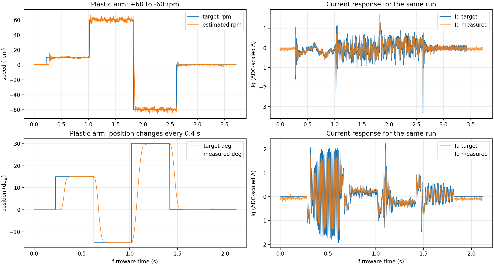

# 塑料臂带载快速响应调试记录（2026-09-28）

后续已将带臂**位置轨迹**从本页的 2000/1600 rpm/s、90 rpm 改为 4000/3200 rpm/s、150 rpm；电流环与速度模式参数不变。最新带臂定位实测与更新后的诊断阈值见[定位提速与后续优化](position-speedup-and-foc-roadmap-2026-09-28.md)。本页曲线和指标保留为改动前的带臂基线。

## 结果

实物为 STM32F405 板的 M0 接口、TLE5012B 编码器、ZH3620-1 电机；电机装有一根可双向连续旋转的塑料臂，母线约 12 V。本次逐项调了速度目标变化率、速度比例增益、定位加减速和定位比例增益。最终参数已经编译、经 ST-Link 烧录并校验，随后又用原生 USB 完成两轮常规响应、两轮连续换位和一轮每段 3 秒的保持测试。

保留参数：电流环 `Kp=0.20 V/A`、`Ki=192 V/(A·s)`、抗饱和回算 `1200/s`；速度环 `Kp=0.18 A/rpm`、`Ki=0.48 A/(rpm·s)`、目标变化率 `4500 rpm/s`；位置环 `Kp=12 rpm/°`、加速 `2000 rpm/s`、刹车 `1600 rpm/s`。位置最高接近速度仍为 `90 rpm`。电流控制继续使用 10 kHz、M0 顺序 ADC 28 周期与原来的采样点 8200；此次没有为了压低曲线噪声而给实时反馈增加低通延迟。

最终固件的 WARN 策略仍然只是报警。M0 和 ZH3620-1 的目标电流告警阈值从过时的 0.30 A 更新到 3.00 A，相电流告警阈值更新到 4.00 A；它们**不是限流值**。3 秒稳速试验和短时换向验证了下表工况，没有验证电机 12 A 堵转能力、长期温升、额定扭矩，也没有用外部仪表校准固件报告的安培值。

## 实测表现

指标中的“到位”从固件遥测确认收到新目标开始算：速度对 20 ms 尾随平均值要求进入目标 ±3 rpm 并持续 100 ms；位置要求进入 ±0.5° 并持续 100 ms。PC 发命令及 USB 排队的延迟不包含在内。

| 塑料臂工况 | 旧参数 A | 最终参数 M | 说明 |
|---|---:|---:|---|
| 0→15° 到位 | 124 ms | 76 ms | 两者均为逐项扫描中的 2 秒换位 |
| 15→−15° 到位 | 170 ms | 109 ms | 旧参数加速/刹车为 800/640，最终为 2000/1600 |
| +20 rpm 稳态反馈标准差 | 1.263 rpm | 0.963 rpm | 末段 0.5 秒，未经额外显示平滑 |
| −20 rpm 稳态反馈标准差 | 1.089 rpm | 0.787 rpm | 同上 |

旧参数 A 使用速度 Kp=0.12、Ki=0.48、速度变化率 900 rpm/s、位置加速/刹车 800/640 rpm/s、位置 Kp=10；电流环与最终参数相同。扫描不是单次把所有增益加大：先试速度斜率 1500、2000、2500，再试位置 1200/960，速度 Kp 0.14、0.16、0.18，位置 1600/1280、2000/1600，速度斜率 3500、4500，最后位置 Kp 12。每一步都保存了电流、母线、到位时间、波动、超调和故障。详细逐段数字在[机器可读记录](data/loaded-arm-fast-20260928.json)。

±60 rpm 比较是后来才加入的，不能把旧参数 A 和这个工况直接作实测对比。以中间配置 F2（速度 Kp=0.14、斜率 2500 rpm/s）为参照，+60→−60 rpm 的到位时间为 64.4 ms；最终固件复测两次为 **43.6、44.4 ms**。最终 +10→+60 rpm 为 **26.6、25.6 ms**。每段 3 秒的补充测试又测到 +60→−60 rpm **43.4 ms**，稳速末段均值 +59.982 / −59.998 rpm，原始反馈标准差约 1.94 / 1.88 rpm，故障及丢帧均为零。

每 0.4 秒连续切换 `15°→−15°→30°→0°` 的最终两轮，到位约为 `127/106/140/109 ms` 与 `127/107/141/107 ms`；两轮最大位置超调约 0.18°，记录到的目标 Iq 峰值 2.23 A。每段 3 秒的保持测试中，−15° 和 30° 末段位置反馈标准差约 0.008°；15° 和 0° 末段约 0.039°、0.054°，不同塑料臂姿态确实有差别。位置反馈精度是编码器读数，并非独立测得的轴位置精度。

## 电流环判断与电流代价

电流环的 `0.20/192` 在前一轮带载 A/B 实验中已胜过 `0.20/24`，而提高比例增益到 `0.30` 未稳定降低误差，因此本轮保留电流 PI，只检查它能否跟随更快的外环。最终小电流阶跃 `±0.05→±0.10→±0.20→0 A` 的稳态偏差绝对值最高约 1.6 mA；1 ms 平均误差 RMS 约 8.7–15.6 mA。组 5 原始电流误差 RMS 约 28–38 mA，说明显示出的电流线粗细有相当部分来自采样波动。所有阶跃记录连续且无故障。具体前后参数比较见[电流采样与调参](current-sampling-noise.md)。

快速运动时目标 Iq 本身会频繁变化。最终 ±60 rpm 两轮的目标电流峰值分别是 **3.35 A**（单次约 0.2 ms 尖峰）和 **2.24 A**；对应实际 Iq 峰值约 2.99 A、2.03 A。另一轮每段 3 秒测试的目标峰值约 2.99 A。最终常规位置测试的目标峰值为 1.90、2.24 A。最低母线约 **11.87 V**。第一次验收因为 PC 脚本原设 3 A 上限，在 3.03 A 单点处自动停机；查看记录后把**PC 测试边界**改为 3.5 A 继续，未修改运行时输出钳位。所有最终完整记录故障为零、丢帧为零。安培数由板载 ADC 和标称比例换算，尚未用独立电流探头校准。

曲线上高速旋转与大幅换位时，目标 Iq 和实际 Iq 都有周期性起伏；这说明外环在持续补偿转速估计与塑料臂负载的变化，不能仅从线条粗就认定电流 PI 自身在振荡。3 秒稳速的实际反馈仍有约 1.9 rpm 标准差，位置保持的波动也随姿态变化。继续改善前应先确认编码器机械安装、同轴度、电流采样比例和真实轴振动；在这些因素未独立测量前，不宜声称已达到全局最优。

## 卸下塑料臂后的对比

当前项目以前保存过空载数据，但那时电流与外环参数不同，所以**不能把历史空载曲线与这里的塑料臂数据直接相减，称为负载影响**。本次保留了相同固件可复测的协议和 1 kHz 归档波形：[归档数据](data/loaded-arm-fast-20260928.npz)。数组为每帧 13 个 32 位通道的 `uint32` 视图，每 5 个 5 kHz USB 帧留一个；目标、反馈、状态、母线和设备时间戳仍在，精确帧顺序与事件在 JSON 中。完整 5 kHz 原始帧仍在本机被 Git 忽略的 `build/outer-sweep-20260928/final/`。

卸下塑料臂后的同固件速度首测因目标 Iq 瞬态达到约 −7.20 A 被 PC 实验边界中止；小电流阶跃完成了同固件对照。随后重调裸轴外环，完成速度、位置及 3 秒保持测试。数据、参数和解释边界见[卸臂对比记录](free-shaft-vs-plastic-arm-2026-09-28.md)。用户随后要求将工程默认构建选回塑料臂参数。

## 源码与验收

参数在 `variants/m1-mt6835/App/Config/foc_motor.h` 的 ZH3620-1 分支，M0 告警阈值在 `App/Config/foc_port.h`。M1 参考电机的控制参数没有改。PC 采集脚本增加可选目标电流与位置测试边界，测试边界不参与固件。正常 USB 总览仍是 VOFA 的 24 通道、1000000 波特率设置；速度、位置、Iq 的目标与实际值都在组 6。

最终固件构建通过，ST-Link 下载及校验通过。默认 M0 参数矩阵、控制观察器、M0 命令/遥测/告警回归及 Python 响应计算测试通过。最终实机记录在完整换向、换位和 3 秒保持期间无故障、无丢帧；测试结束发送了 `stop`。最后从 VOFA 总览通道核对到母线 12.00 V、模式/状态/故障均为 0、目标 Iq 为 0、告警与拒绝数均为 0，并释放 COM8。这些结果只覆盖当前塑料臂、约 12 V 和短时工况。
