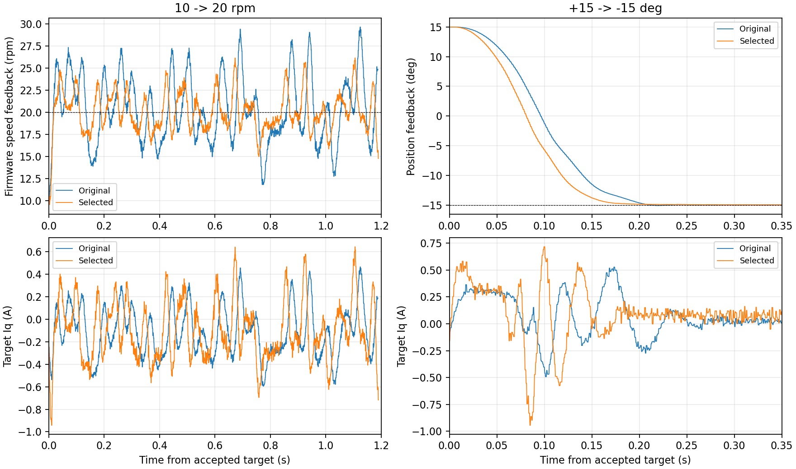

# 塑料臂负载：参数逐项对比与保留结果

## 结论

2026-09-27，在 M0、TLE5012B、ZH3620-1、约 12 V、电机装有塑料臂的条件下进行了 10 轮实机短测。保留速度环 Kp=0.12、Ki=0.48，定位加速度 800 rpm/s、刹车参数 640 rpm/s。新参数已编译、烧录并校验。每轮结束都发送 `stop`，最后状态为待机，故障和拒绝计数均为 0。

比起原参数，速度反馈波动明显减小，位置运动更快，保持精度没有明显下降。代价是动作中的峰值电流增大。这里验证的是小角度、低速、短时工况，没有验证高转速、长时间温升或其他负载。

## 改了什么

修改位置是 `variants/m1-mt6835/App/Config/foc_motor.h` 中 ZH3620-1 的参数分支。

| 参数 | 原值 | 保留值 | 含义 |
|---|---:|---:|---|
| 速度 Kp | 0.060 | 0.120 A/rpm | 速度偏离目标时，更快产生纠偏电流 |
| 速度 Ki | 0.240 | 0.480 A/(rpm·s) | 更快消除持续的速度偏差 |
| 定位加速度 | 600 | 800 rpm/s | 更快建立定位运动速度 |
| 定位刹车参数 | 480 | 640 rpm/s | 随加速度调整接近目标时的减速曲线 |

电流环 Kp=0.20、Ki=24/s，速度命令斜率 900 rpm/s，位置 Kp=10、接近速度上限 90 rpm，均沿用之前设置。采样点、ADC 方案、USB 24 通道布局与 2.5 kHz 总览帧率沿用原设置。固件仍采用 WARN 策略。

## 怎样比较

每轮先复位，确认遥测有效且待机，再 `zero`、`clear`。顺序为：

1. `pos 15`、`pos -15`、`pos 0`，各保持 2 秒。
2. `stop` 0.3 秒。
3. `rpm 10`、`rpm 20`、`rpm -20`，各保持 1.2 秒。
4. `rpm 0` 0.5 秒。
5. `pos 0` 保持 2 秒，回到本轮起点，然后 `stop`。

最后返回起点，有助于减少下一轮起始姿态差异。但停机后的自由运动、每次启动的电流零偏和塑料臂姿态仍可能带来差异。因此保留参数测试了三次，并在中间重新烧录原参数复测；原参数结果也能够重复。

采集脚本设有这次实验的中止条件：遥测中断、非有限数、故障、母线不在 8–12.6 V、速度反馈超过 ±120 rpm、目标电流超过 ±1.8 A。它们是 PC 测试边界，并非新增固件限流。脚本无论正常或异常退出都会尝试发送 `stop`。

采集每段使用独立编号文件，避免两次 `pos 0` 或 `stop` 覆盖数据。统计采用设备时间戳。完整原始数组在忽略目录 `build/arm-tune-20260927/`；可提交的摘要在 [数据记录](data/loaded-arm-tuning-20260927.json)。

## 调参过程

| 轮次 | Kp | Ki | 定位加速/刹车 rpm/s | +20 rpm 波动标准差 rpm | -20 rpm 波动标准差 rpm | 判断 |
|---|---:|---:|---:|---:|---:|---|
| A | 0.06 | 0.24 | 600/480 | 3.961 | 3.747 | 原参数基准 |
| B | 0.04 | 0.24 | 600/480 | 5.260 | 4.594 | 淘汰：低速波动、定位超调变大 |
| C | 0.08 | 0.24 | 600/480 | 3.102 | 3.018 | 比原参数好 |
| D | 0.10 | 0.24 | 600/480 | 2.529 | 2.461 | 继续改善 |
| E | 0.12 | 0.24 | 600/480 | 2.148 | 2.082 | 本轮比例增益比较中最好 |
| F | 0.12 | 0.48 | 600/480 | 2.132 | 2.073 | 10 rpm 平均偏差减小 |
| G | 0.12 | 0.48 | 800/640 | 2.181 | 2.068 | 定位更快，保留 |
| G2 | 0.12 | 0.48 | 800/640 | 2.282 | 2.047 | 新参数重复 |
| A2 | 0.06 | 0.24 | 600/480 | 4.002 | 3.810 | 原参数复测，结果接近 A |
| G3 | 0.12 | 0.48 | 800/640 | 2.182 | 2.073 | 最终烧录参数复测 |

上述是最后 0.5 秒的未额外平滑速度反馈标准差。并未继续增加 Kp，所以不能称 0.12 为全局最优。此次选择是已测范围中较好的速度波动与电流峰值折中。

## 最终效果与代价

以下比较原参数 A2 和最终参数 G3：

| 指标 | 原参数 | 新参数 |
|---|---:|---:|
| 10 rpm 平均反馈 | 9.634 rpm | 9.895 rpm |
| 10 rpm 波动标准差 | 3.111 rpm | 1.582 rpm |
| +20 rpm 平均反馈 | 20.112 rpm | 19.949 rpm |
| +20 rpm 波动标准差 | 4.002 rpm | 2.182 rpm |
| -20 rpm 平均反馈 | -19.934 rpm | -19.835 rpm |
| -20 rpm 波动标准差 | 3.810 rpm | 2.073 rpm |
| 0→15° 定位进入并保持误差带 | 122.8 ms | 111.2 ms |
| 15→-15° 定位进入并保持误差带 | 197.2 ms | 164.8 ms |
| -15→0° 定位进入并保持误差带 | 148.4 ms | 119.6 ms |
| 三次小角度定位的最大超调 | 0.084° | 0.029° |
| 全轮目标 Iq 峰值 | 0.829 A | 1.253 A |

定位误差带为 ±0.5°，且必须连续保持 100 ms；时间从遥测反映已接受新目标开始计，不包含 PC 发命令的全部延迟。新参数三轮全轮目标电流峰值为 1.186–1.283 A，最高峰出现在速度测试后返回起点的较大角度动作。原参数两轮为 0.829–0.876 A。

新参数的 ±15° 和回零保持段，最后 0.5 秒位置标准差约 0.005–0.008°。这反映编码器和控制器自身的反馈稳定性，不等于独立量具测得的轴位置精度。速度也是编码器估计值，尚不能把所有残余波动都认定为实际机械转速波动。

主机回归已通过：默认 M0 的 USB 命令、遥测、三种模式、WARN 目标保持与传感器恢复；观察器的停机跟踪、时间回绕、启动目标、命令重发、电压抗积分饱和与采样间断恢复。最终固件烧录校验成功，随后重新读取 24 通道，确认目标 Iq=0、状态=0、故障=0、拒绝=0，并释放 COM8。

10 轮均无故障、命令拒绝或遥测记录中的电压饱和。短测通过不代表长期带载验收。



图中速度曲线采用未额外平滑反馈。下排是速度环输出的目标 Iq；可以看到新参数的电流纠偏更强。电流正负由安装校准方向决定，不能直接按机械转动正负判断。

## 仍需解决的问题与下一步顺序

1. **低速仍有波动。** 新参数把波动减小约一半，但没有消除。先同步分析单圈原始角度、校正角度与实际 Iq，分辨磁编误差、机械扰动和电流跟踪误差。不要只给显示曲线加低通后宣布改善。
2. **长时间累计角度精度问题仍存在。** 前一轮发现很大的浮点累计角度会损失小角度分辨率。本轮每次复位后短测，避免了大累计量，但没有修改该算法。下一步应把单圈角度、整数圈数和局部速度差分分开，保持电角度反馈与多圈位置功能，再做跨圈和长跑验证。
3. **验证新参数的电流跟踪与温升。** 当前峰值更高，应先做同样的小角度动作与更长保持，记录实际 Iq、Id、母线及温升；电流单位仍应结合独立测量确认。
4. **然后改善轨迹连续性。** 当前速度斜率和定位刹车曲线已较快。如果机械臂动作仍生硬，再增加连续加速度或 S 曲线，比较完成时间、振动与峰值电流。不要仅不断提高增益。
5. **最后考虑负载补偿。** 确认塑料臂长度、重量、转轴方向后，再判断是否需要重力或惯量前馈。本次没有凭未知负载编造补偿系数。

复现实验从固件根目录执行：

```powershell
python variants/m1-mt6835/tools/bench/loaded_arm_probe.py build/my-arm-run
python variants/m1-mt6835/tools/bench/analyze_loaded_arm.py build/my-arm-run
```

先断开 VOFA 的 COM8 连接。采集程序会真实驱动电机，适用于本次已验证的可转动塑料臂工况。不同机械行程、供电和负载需要重新制定测试动作与边界。
