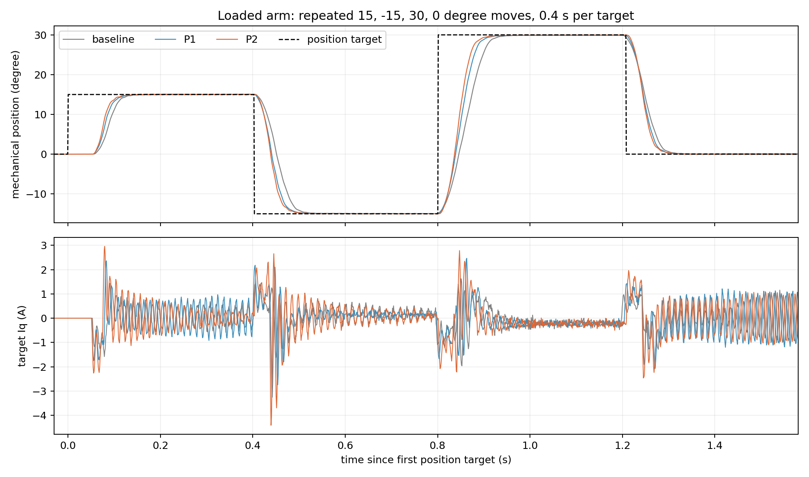

# 带塑料臂定位提速与下一步 FOC 改进（2026-09-28）

## 本轮改了什么

对象是同一台 ZH3620-1 电机、TLE5012B 编码器、M0 功率接口，装有可双向连续旋转的塑料臂，母线约 12 V。保持已经调好的 10 kHz 电流环、1 kHz 速度环、速度模式斜率及位置 P=12 rpm/°；只调整**位置模式**的最高接近速度、加速和刹车。这样能判断定位轨迹本身是否限制响应，也避免把不同环路的变化混在一起。

位置环的工作方式很直白：当前位置距离目标越远，就要求更高的转速；程序用最高转速封顶，并根据剩余距离算出应该开始刹车的速度；内层速度 PI 再把速度误差变为目标 Iq。旧配置在短距离运动中已经碰到 90 rpm 接近速度上限。它的速度 P、刹车和加速也一起约束了到位时间。改动位于 `variants/m1-mt6835/App/Config/foc_motor.h` 的 `PLASTIC_ARM` 分支，`FREE_SHAFT` 参数不变。

| 带臂配置 | 位置加速 | 刹车 | 接近速度上限 | 15→−15→30→0° 平均到位时间，两轮 | 最大位置超调 | 目标 Iq 峰值 |
|---|---:|---:|---:|---|---:|---:|
| 原配置 | 2000 rpm/s | 1600 rpm/s | 90 rpm | 126/106/137/107 ms | 0.096° | 1.96 A |
| P1 | 3000 rpm/s | 2400 rpm/s | 120 rpm | 120/93/118/90 ms | 0.080° | 3.25 A |
| **保留 P2** | **4000 rpm/s** | **3200 rpm/s** | **150 rpm** | **115/86/106/85 ms** | **0.066°** | **4.41 A** |
| P3，未完成 | 6000 rpm/s | 4800 rpm/s | 180 rpm | 第一段被 PC 测试边界中止 | 未测 | 中止点目标 5.69 A |

“到位”定义为进入目标 ±0.5 机械度并保持 100 ms，从固件遥测确认新目标开始计时；不包含电脑发送和 USB 排队。表中目标 Iq 是固件命令，不等于独立电流探头实测相电流。P2 的 0.4 秒序列中，目标 Iq 大于 3 A 的累计时长约 6 ms，大于 4 A 约 2 ms；板上反馈的实际 Iq 最大约 3.75 A。电流比例尚未经外部仪表标定。P3 在首段 `pos 15` 达到约 5.69 A 目标时，PC 按预设实验边界发送 `stop`；它不是通过测试的配置。

同一组命令、同一记录方法下，P2 相比原配置四段到位分别缩短约 9%、19%、23%、20%。曲线显示改善主要在移动段；保持阶段的目标 Iq 仍有周期性起伏，单纯继续增加轨迹加速度不会解决这个问题。两轮 P2 短测均无故障和 USB 丢帧。完整指标见[机器可读记录](data/position-speedup-loaded-20260928.json)，波形见[约 1 kHz 归档](data/position-speedup-loaded-20260928.npz)；5 kHz 原始帧在本机被 Git 忽略的 `build/arm-position-20260928/`。

## 为什么保留 P2

P2 又通过了三项补充检查：

1. 更大角度 `30→−30→60→0°`，到位约 **137/121/153/117 ms**，最大超调约 0.07°，最大目标 Iq 约 3.74 A。
2. 每 0.25 秒连续切换 `15→−15→30→0°` 两轮，到位约 **114/87/104/82 ms**，最大超调约 0.104°；没有下一条命令到来时还未稳定的情况。
3. 每段保持 3 秒时，四个目标的末段角度反馈标准差约 **0.008/0.016/0.041/0.006°**。速度模式 `10→60→−60→0 rpm` 未改变参数，单轮 +60→−60 rpm 仍约 **43 ms** 到位。

这些是**短时、约 12 V、目前这根塑料臂**的结果。没有记录板上器件的连续温升；角度、转速和电流均取自固件自身遥测，不能当作独立仪器测得的真实轴精度或绝对安培值。P2 明显缩短定位，但会增加短脉冲转矩电流；更长时间、更大负载或不同电源需要另验收。

### 与新轨迹一致的诊断阈值

最初的 P2 固件沿用旧的 **3 A 目标电流、4 A 相电流、100 rpm 速度**诊断阈值。一次完全正常的 P2 定位后，总览仍留下 `3072` 告警位，即 `CURRENT` 与 `SPEED`；这两个旧阈值已低于本轮验证过的正常短时轨迹，并非故障或限流。为使告警有辨别力，把 M0/ZH3620-1 的短时台架诊断阈值更新为**目标 Iq 5 A、相电流 6 A、速度 200 rpm**。P2 实测速度峰值约 164 rpm；目标 Iq 峰值约 4.41 A。此处的 5/6 A 是告警门槛，**不是已证明可持续承受的额定电流**；默认 `WARN` 不据此裁剪输出。可选 `TRIP` 也会采用新的门槛，若使用 TRIP 必须单独验收。

新固件经 ST-Link 烧录校验后，再做一次同样的短换位，到位约 **110/85/106/87 ms**，无故障和 USB 丢帧。随后发送 `stop`，VOFA 总览显示母线 **12.00 V**，模式/状态/故障/告警/拒绝数均为 **0**，目标 Iq 和目标转速为 0。板上最终带臂固件 SHA-256 为 `e0a74f0d141d1d95ec67e2d9ee495076cdcea5b64649e3688776973f2a52a306`。

## 与成熟 FOC 方案相比，优先改什么

当前程序已经具备有感角度、Clarke/Park、Id/Iq 双电流 PI、抗积分饱和、SVPWM、母线电压反馈、电角度预测、速度/位置串级控制，以及可选接口/编码器/电机/负载配置。它不是只有开环换相。要继续提高**可重复的控制效果**，以下项目比直接继续堆高位置增益更有价值。成熟库常提供串级位置环、轨迹规划、参数辨识和前馈，但具体功能不必照单全加。[SimpleFOC 对串级位置环的说明](https://docs.simplefoc.com/angle_cascade_control)、[TI 的 FOC 电流环与电机参数指南](https://www.ti.com/lit/ug/sluudm5/sluudm5.pdf)、[ST Motor Control SDK 功能概览](https://www.st.com/en/embedded-software/x-cube-mcsdk.html)。

| 顺序 | 目前的实际缺口 | 建议怎么做、想得到什么 |
|---|---|---|
| 1 | **电流绝对比例和电机电参数还没有实测标定。** 当前相电阻参数 `0.12 Ω` 是旧粗估；相电感、磁链参数为 0，因此 dq 解耦与反电动势前馈实际关闭。软件记录的“4 A”尚未用电流探头校准。 | 先用外部仪器校准 B/C 两路电流增益和零点、母线电压；断开驱动后复核三对相间电阻，用低压阶跃或 LCR 仪估计相电感，再测反电动势常数。确认相/线定义后写进电机档案。TI 的方案会根据电阻、电感建立电流 PI 初值，但本机仍须实测验证。[TI 电参数与电流 PI](https://www.ti.com/lit/ug/sluudm5/sluudm5.pdf) |
| 2 | **速度估计及测量噪声限制外环。** 裸轴 ±60 rpm 反馈标准差曾有 8–9 rpm，带臂保持位置时目标 Iq 仍有周期性起伏；现有数据不能区分真实轴摆动、编码器安装误差和速度微分噪声。 | 用独立测速或轴标记视频与编码器遥测同步核对；检查磁钢同轴度、编码器时序和每圈角度误差。再对 1 kHz 外环的速度估计比较目前滤波、相位跟踪/PLL 或按速度自适应的估计器，以同样的延迟和真实轴响应评判。不要只让 VOFA 曲线变平。低速定位若有周期性力矩波动，可在证实后研究齿槽补偿。[TI 关于低速齿槽影响](https://www.ti.com/document-viewer/lit/html/SSZTBL1/GUID-9F1C872B-7B49-4C59-A9AB-FDF04E4E61CA) |
| 3 | **轨迹还只是速度封顶与加减速、按距离刹车。** 直接换大位置目标会产生较尖的目标 Iq 脉冲；P3 已触及 5.69 A 实验边界。 | 在保留当前 P2 作为对照的前提下，建立有明确速度、加速度、加加速度约束的轨迹；先测塑料臂惯量/摩擦，再尝试速度与加速度前馈，让电流 PI 负责修正误差。目标是在相同到位时间下降低尖峰和机械冲击，而非单纯放慢。TI 的运动控制资料将惯量识别与轨迹规划列为独立环节。[TI 运动控制指南](https://www.ti.com/lit/ug/spruhj1i/spruhj1i.pdf) |
| 4 | **电流环目前主要靠小阶跃统计评估。** 顺序 ADC 28 周期/8200 触发点、双 ADC 和采样长度都做过 A/B 实验；同步 ADC 没有稳定证明更低噪声。 | 保持当前顺序采样，先完成标定和不同电角度/调制比下的电流阶跃与频率响应测试，量出电流环有效带宽、相位裕量和电压饱和时表现；再决定是否做同周期双采样或 dq 前馈。大电流运动段尤其要核对目标 Iq 与实际 Iq 的延迟。相关已有[采样分析](current-sampling-noise.md)与[电流采样对照](current-sampling-noise.md)。TI 的成熟方案用电机 R/L 计算 PI 初值，同时明确积分饱和处理。[TI FOC 指南](https://www.ti.com/lit/ug/sluudm5/sluudm5.pdf) |
| 5 | **负载参数需手动选，验收覆盖面有限。** 目前按 `PLASTIC_ARM`/`FREE_SHAFT` 编译选择；没有惯量辨识或换负载后的自动调参。 | 保持命名清楚的电机与负载配置，归档每个负载的电压、温升、响应和固件散列。以后若常换负载，可做带有人工确认的惯量辨识与参数推荐；不要在首次启动时盲目自动施加大转矩。TI 的调参指南也使用惯量/摩擦来建立速度环参数。[TI 速度环调参指南](https://www.ti.com/lit/ug/sluudh9/sluudh9.pdf) |

弱磁、MTPA、无感启动等确实出现在成熟平台的功能表中，但当前重点是约 12 V、几十到百余 rpm 的有感定位；在位置轨迹、速度估计和电流标定尚未解决时，它们不是优先项。实验台按用户选择继续使用 `WARN` 告警策略；若以后装入实际设备并连续工作，需要另外评估独立硬件短路保护、温度与持续电流能力。当前短测不能代替这些验收。[ST MCSDK 功能概览](https://www.st.com/en/embedded-software/x-cube-mcsdk.html)。
