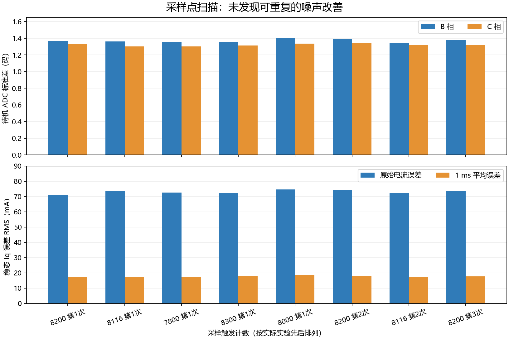

# PWM 电流采样点对照实验

## 结论

**保留原来的 M0 采样触发计数 8200。** 在本次测试的 7800–8300 区间，没有找到可重复降低噪声的采样点。8116 的几何窗口更对称，但其电流误差与 8200 基本相同；不能把窗口对称直接当作降噪效果。

已恢复并烧录默认固件：M0 + TLE5012B + ZH3620-1，10 kHz 电流环，USB divider=2、5 kHz 遥测，CDC 参数 1000000，Kp=0.20、Ki=24。电流反馈没有加入滤波。最终电机输出关闭，校准有效。

## 实验怎样做

- 五个触发值：7800、8000、8116、8200、8300。换算触发时刻约为 46.43、47.62、48.31、48.81、49.40 µs，基准是 PWM 谷底。
- PI、ADC 采样长度、编码器参数和其他固件配置保持一致。改变触发点后，现有宏同时更新采样窗口、占空比预算及电角度预测。
- 实验固件临时使用 USB divider=1，记录完整 10 kHz 数据。母线约 11.5 V，初始机械角约 99.9–100.6°。
- 每批先记录两秒待机原始 ADC、两秒待机电流，再做两轮正负向短阶跃：±0.05、±0.10、±0.20 A，然后 Iq=0、stop。
- 从目标变化后排除前 30 ms，比较稳态误差。每批表中的 RMS 是六个非零目标、各两次重复，共十二个分段 RMS 的算术平均；包含噪声和均值偏差，不是纯噪声标准差。
- 8200 测三批，8116 测两批，其余各一批。实验顺序：8200a → 8116a → 7800a → 8300a → 8000a → 8200b → 8116b → 8200c。
- 待机 ADC 统计使用浮点双精度计算，避免对较大零点附近的微小波动使用单精度累加造成统计误差。

## 实测结果

| 触发值 / 批次 | B 相待机标准差（码） | C 相待机标准差（码） | 原始 Iq 误差 RMS（mA） | 1 ms 平均后误差 RMS（mA） |
|---|---:|---:|---:|---:|
| 8200 / 第一次 | 1.364 | 1.328 | 71.13 | 17.50 |
| 8116 / 第一次 | 1.361 | 1.302 | 73.49 | 17.57 |
| 7800 | 1.356 | 1.301 | 72.66 | 17.32 |
| 8300 | 1.357 | 1.312 | 72.45 | 17.92 |
| 8000 | 1.402 | 1.335 | 74.54 | 18.50 |
| 8200 / 第二次 | 1.387 | 1.343 | 74.11 | 18.03 |
| 8116 / 第二次 | 1.344 | 1.320 | 72.36 | 17.26 |
| 8200 / 第三次 | 1.382 | 1.320 | 73.56 | 17.72 |



8116 两批的原始误差均值约 **72.92 mA**，8200 三批约 **72.94 mA**，几乎一样。1 ms 平均误差分别约 **17.41 mA**、**17.75 mA**，差约 0.34 mA；8200 自身三次范围为 17.50–18.03 mA。没有足够证据认为这个小差异是稳定改善。

也没有发现采样点越靠前或越靠后，噪声就持续下降的趋势。本轮的功率调制量较小、采样点均位于较宽的安静窗口内；结果支持在该工况下保留已有触发点。它不能证明所有转速、负载、占空比都应使用同一个最佳位置。

## 时序及最终固件核验

- 八批对照记录均无 USB 丢帧、故障或电压饱和。
- 从第二批起各批另读取调试计数：ADC 错误、编码器错误、控制时序错误均为 0。第一批未单独读取这些计数，不用后续计数替代它的记录。
- 对照期间读取到的采样处理墙钟最大值不超过约 38.84 µs；包括编码器等待和中断抢占，不是纯 CPU 占用。最小 PWM 写入计数为 3443，仍高于当前 600 的写入时序门槛。
- 五个触发值均通过主机上的全电角度饱和调制窗口回归，仍保留两相采样保持区间。
- 默认固件烧录后校验成功，读取 TIM1 CCR4=8200。
- 默认固件的最终短测中，+0.20 A 的稳态内部读数约 +0.1984 A，−0.20 A 约 −0.1915 A；正负向仍有偏差，不能认为这轮修复了测量精度。
- 恢复 USB divider=2 后，10 秒连续性检查通过：50041 帧，约 5000.7 帧/s、260039 B/s。
- 最后读取状态为 idle、fault=0、warnings=0，ADC/编码器/时序错误计数均为 0；TIM1 CCER 仅 CH4 采样触发开启，三相输出关闭。

恢复后组 5 是两次电流样本的遥测平均，不能拿其单点 RMS 与表中完整 10 kHz 原始电流 RMS 直接比较。表中的安培值沿用当前固件换算，绝对电流增益尚未外部标定；没有示波器验证模拟建立时间，也没有覆盖带载、高速和大调制量。

## 程序保留了什么

新增可选构建参数 `FOC_M0_TRIGGER_TICKS`，留空时使用源码默认 8200；实验参数允许 7000–8350。它只作用于 M0，方便以后重复对照，不增加运行时分支或反馈滤波。

例如在独立构建目录试验：

```powershell
cmake --preset Debug-local -B build/Sampling-sweep -DFOC_USB_DIVIDER=1 -DFOC_M0_TRIGGER_TICKS=8116
cmake --build build/Sampling-sweep
```

恢复正常构建时使用 `-DFOC_M0_TRIGGER_TICKS=` 清空覆盖参数，并恢复 `-DFOC_USB_DIVIDER=2`。不要仅恢复源码后仍使用缓存中的实验值。

完整 10 kHz 的原始记录、各次构建/烧录日志和 RAM 读取在本机 `variants/m1-mt6835/build/bench_debug/20260927_sampling/`。可归档的比较数据见 [实验数据摘要](data/sampling-point-20260927.json)。

## 下一步

优先做待机 UART 遥测开/关的对照，验证此前发现的五周期偏移；然后改造双 ADC 同步采样，消除两相约 1.90 µs 的时间错位。再独立比较采样长度或同周期平均。采样点扫描目前没有支持继续靠细调触发值获得明显降噪的证据。
