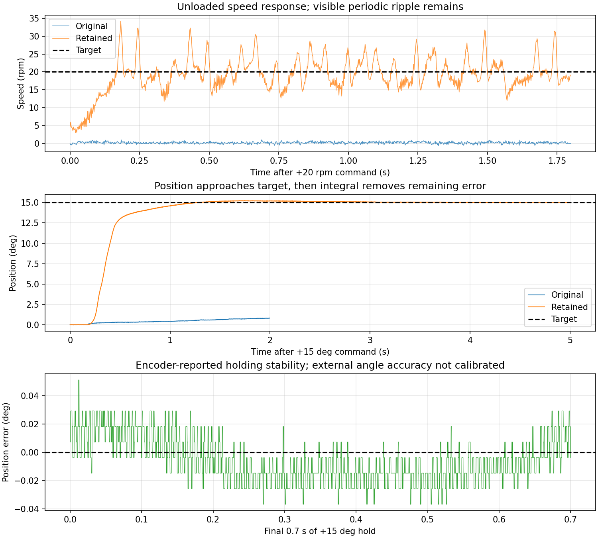

# 速度环与位置环实机调试记录

## 1. 当前能做到什么

2026-09-27，已在 **M0 + TLE5012B + ZH3620-1、约 11.5 V、轴空载**上修改、烧录并验证。电流环仍为 10 kHz，USB 仍为 5 kHz JustFloat，VOFA 串口设置仍为 1000000。

现在可以持续正反转、改变转速，以及定位后保持位置。**定位效果较好；低速平均转速已经跟踪目标，但瞬时转速仍有周期波动，尚未达到精密匀速。**本轮没有验证负载、长时间温升、高速或外力扰动后的恢复，以下角度精度都是编码器内部读数，不是外部角度标定结果。

| 工况 | 原版表现 | 保留方案表现 |
|---|---|---|
| +20 rpm | 短测末段平均约 0.15 rpm，基本未起转 | 5 秒工况末段平均 20.13 rpm，标准差 3.92 rpm |
| −20 rpm | 短测末段约 −0.08 rpm，原正转积分还未消退 | 5 秒工况末段平均 −20.05 rpm，标准差 3.81 rpm |
| +40 / −40 rpm | 本轮未测原版 | 3 秒工况末段平均 39.74 / −39.78 rpm，标准差约 5.7 rpm |
| +15° 定位 | 2 秒工况末段只到约 0.69° | 5 秒工况末段平均 14.994°，误差 −0.006° |
| −15° 定位 | 2 秒工况末段仍在约 +0.28° | 5 秒工况末段平均 −14.971°，误差 +0.029° |
| 回到 0° | 原版运动不足，不能据此评价保持能力 | 两次 5 秒工况末段误差约 −0.008°、−0.001° |

统计使用每段末尾 **0.7 秒**，排除起动和反向过程；表中原版与长测的等待时间不同，不能据此宣称相同时间下的全部改善倍率。保留方案四次长测定位的末段位置标准差为 0.010–0.016°，峰峰值 0.055–0.088°。刚到目标两秒时仍可能有约 0.5° 偏差，随后积分继续调整，不能把五秒的结果理解为立即达到这个精度。

## 2. 找到并处理的问题

### 外环增益过小，起动困难

原来的速度 Kp=0.002 A/rpm、Ki=0.004 A/(rpm·s)。20 rpm 的初始比例输出只有 0.04 A，测试中主要表现为小角度移动和很慢的积分增长。提高增益后才出现持续旋转。这个结果支持“原参数输出不足”的判断，但并不证明阻力一定来自某一种机械原因。

依次测试了 Kp/Ki 为 0.02/0.04、0.04/0.08、0.06/0.12、0.08/0.16 的方案。0.08/0.16 短测速度波动稍小，但长测出现 1.237 A 的内部电流指令尖峰，测试脚本结束试验并发送 stop。最终保留 **0.06/0.12**，长测最大内部电流指令约 0.752 A；40 rpm 试验最大约 0.899 A。这些是未外部标定的内部安培值。

### 速度滤波的延迟限制反馈强度

在 Kp/Ki=0.04/0.08 时，1 kHz 速度估计用 5 ms 滤波出现较大波动，短测越过最初设定的 0.8 A 主机试验范围。缩短到 1 ms 后，同组增益能完成正反转测试。因此不能单靠提高 Kp，同时把速度曲线滤得很平滑。

保留方案在每次编码器采样后，对用于估计速度的连续角度做 **0.2 ms 一阶预滤波**，每 1 ms 求角度差，再做 **1 ms 一阶速度滤波**。系数由实际时间间隔计算，适用于 M0 的 10 kHz 和 M1 的 20 kHz。电流环的电角度和位置反馈均不经过这个新滤波器，原来的 `foc.rpm` 也保留给电流环的角度预测使用。

这能缓和速度差分噪声，却不能消除电流测量噪声或真实的转矩波动。静止时速度显示仍可能跳动约 1 rpm；应同时看位置是否真的移动，不能只凭速度显示判断轴在转。

### 停机时机械位置不更新

原来 `foc_outer_step()` 仅在 RUN 调用外环，停机后转轴会导致位置显示过时。现在有效采样下持续观察机械位置，只有 RUN 才计算转矩输出。预充电和 PWM 校零期间输出参考为零；观察器处理 24 位时间戳回绕和长时间采样间断，避免把一次长时间位移当成一毫秒的速度。

### 模式切换会遗留旧的外环参考

新的运行或模式会清除旧外环电流参考和积分，并从当前测得转速开始规划速度。同模式连续改目标或重发命令保留积分。允许在 PWM 校零阶段更新目标，修复起动后约 50 ms 内新命令被拒绝的问题。实机已验证在发出 Iq 后 20 ms 改发 rpm，然后切到 hold、rpm 0、stop 的流程；命令拒绝计数为零。

### 位置逼近和反转过于突然

位置 P 环现在始终把逼近速度规划在 ±30 rpm 内，速度参考以 100 rpm/s 加减速。这是运动轨迹参数：远距离目标仍会完成，程序不会因超过它而停止或拒收位置命令。直接 `Iq` 命令仍保持原来的直接电流目标行为。

### 外环积分没有考虑逆变器电压饱和

电流环已有电压抗饱和，速度环却可能继续累积无法执行的电流需求。现在仅在逆变器电压/调制饱和，而且速度积分会进一步推高当前无法实现的电流时，暂停速度积分；误差反向时允许积分退出。WARN 下没有恢复原来的 0.30 A 电流限幅或阈值故障锁定。

### 持续目标被误记为通信超时

WARN 模式本来允许一次命令持续运行，却每毫秒把超过 200 ms 未重发记为通信告警。现在 WARN 下的持续目标不需要 keepalive，也不因为正常的指令静默增加这个告警。明确的通信异常仍可记录；显式 TRIP 模式保留原来的 200 ms 主机看门狗。

## 3. 保留参数和程序结构

| 参数 | ZH3620-1 当前值 | 含义 |
|---|---:|---|
| 电流 Kp / Ki | 0.20 V/A / 24 V/(A·s) | 本轮保持已有电流环参数 |
| 速度 Kp | 0.060 A/rpm | 速度误差立即改变转矩需求 |
| 速度 Ki | 0.120 A/(rpm·s) | 持续误差逐渐补偿摩擦与负载 |
| 位置 Kp | 2 rpm/° | 位置偏差产生逼近速度 |
| 位置逼近速度 | 30 rpm | 远距离移动的速度上限 |
| 速度参考变化率 | 100 rpm/s | 起动、反向和逼近的加减速 |

参数位于 `variants/m1-mt6835/App/Config/foc_motor.h`，归属于电机型号。共用算法位于 `App/Control/control.c`；`App/FOC/foc.c` 提供连续机械角度并执行电流环；`App/Control/app.c` 解析命令、发布遥测。没有把 M0/M1 作为电机型号。本轮仅对上述实物组合调参，换电机或负载后需重新验证这些增益。

控制链可以直白地理解为：

1. 编码器告诉程序轴实际在哪里；程序据此估计轴转得多快。
2. `pos` 模式先把“还差多少度”变成“应该以多少 rpm 靠近”。
3. 速度规划器逐渐改变速度，避免突然加速或反转。
4. 速度 PI 把“转速还差多少”变成 Iq 电流需求。
5. 已有的电流 PI、Park 变换、SVPWM 和驱动器执行这个需求。

方向由安装校准记录处理，不要为倒装编码器在速度命令外再手工改符号。作为背景参考，[ST 的 FOC SDK](https://www.st.com/en/embedded-software/x-cube-mcsdk.html)也支持编码器反馈及速度/位置控制；本项目保留自己的共用控制实现，并未接入该 SDK。

## 4. 在 VOFA 中使用

USB 串口仍选 COM8、1000000，接收协议 JustFloat，发送用文本并附真实换行 `\n`。先发送 `send 3`，然后使用普通单次发送，不必连续重发。

| 命令 | 作用 |
|---|---|
| `rpm 20` | 持续以正方向约 20 rpm 转动 |
| `rpm -20` | 平滑反向到约 −20 rpm |
| `rpm 0` | 维持零速度，PWM 仍工作；它没有位置目标 |
| `stop` | 关闭电机输出，解除保持 |
| `zero` | 在停机时把当前轴位置定义为机械 0° |
| `pos 15` | 转到相对零点 +15°，到达后持续保持 |
| `pos 0` | 回零点并保持，不能替代 stop |
| `hold` | 以命令收到时的当前位置作为保持目标，支持从转动切换过来 |
| `Iq 0.20` | 切回直接电流/转矩控制 |

推荐第一次这样试：`stop` → `zero` → `send 3` → `pos 15`，等待约五秒，再 `pos 0`；最后 `stop`。位置命令是相对零点的多圈机械角度，并非电角度，也不是每发一次都增量移动 15°。转动中发 hold 会先减速，可能暂时越过捕获的位置，再回到目标附近。

在同一网格叠加以下曲线（I 编号从零开始）：

| 网格 | 目标曲线 | 实际曲线 |
|---|---|---|
| 转速 | I8，rpm | I6，rpm |
| 位置 | I5，机械度 | I4，机械度 |
| 外环电流需求 | I2，内部 A | I9，实际 Iq，内部 A |

I7 是旧的、供电流环预测使用的速度估计，调外环优先看 I6。位置模式下 I8 是位置环产生的逼近速度，不是固定 rpm 命令。I0/I1 是打包帧头，不要画成物理曲线。切回 `send 5` 会改变通道含义，不能继续沿用速度/位置的网格绑定。VOFA 的图表设置本轮写入此文档，未通过界面操作修改 VOFA 布局。

## 5. 还剩什么问题，下一步按什么顺序

1. **定位已经能保持，先复查重复性。**选择多个轴位置，分别等待 2 秒和 5 秒，比较位置误差和保持电流。之后再测受控的小负载扰动；本轮没有用手施加外力测试。
2. **处理低速周期波动的来源。**20 rpm 附近仍有约 4 rpm 标准差，5 rpm 时相对波动更大。记录多圈角度、速度和 Iq，检查波动是否固定出现在同一机械角度。齿槽转矩、安装偏心、相电流增益不一致、驱动死区均是待排查原因，当前数据不足以判定是哪一种。
3. **优先验证电流测量与电角度校准。**确认电流换算比例和各相增益，再比较不同角度的电流阶跃响应；电流环能跟踪内部 Iq 不等于实际转矩一定均匀。不要用高 Ki 掩盖换相或采样问题。
4. **确认周期来源后，再加安装相关补偿。**若是可重复的角度扰动，可以考虑转矩前馈表；若是编码器偏心，则校正角度。补偿表应绑定电机、编码器和安装编号，不能作为所有固件的通用常量。
5. **最后提高速度环带宽和验证负载。**当前更高增益已经出现额外电流尖峰，不应直接继续增加。先解决转矩均匀性，再调整 Kp、Ki，最后改变位置 Kp 与轨迹参数。

## 6. 验证记录

主机回归通过：默认 M0 命令/遥测与 WARN 行为、参考 M1 命令与电流参考替换、速度/位置被控对象仿真、10/20 kHz 观察器、时间戳回绕、停机跟踪、预充电目标更新、模式清理、重发保持积分、下游电压饱和、采样间断恢复。

实机完成多组增益对照、±20 rpm、±40 rpm、±15°、回零保持、Iq→rpm→hold→rpm 0→stop。完成的记录没有故障、序号丢帧；最终定位记录有两次 ±1 µs 时间戳变化，帧序号连续。更激进参数的主机中止试验已保留说明，不计为成功测试。主机试验的转速/电流/位移范围不在固件中实施，也不会让后续命令锁死。

最终读取：ADC 错误、编码器错误、时序故障和命令拒绝计数均为 0；输出已关闭，状态 0、故障 0、告警已清零，TIM1 CCER=0x1000，仅保留采样通道。校准记录保持 v3，身份 0x22110007，方向 −1。当前循环最大工作耗时计数为 6479 个 168 MHz 时钟，约 38.6 µs，小于 100 µs 周期。

原始帧及读取日志位于本机 `variants/m1-mt6835/build/bench_debug/20260927_outer/`；可审阅汇总在 [data/speed-position-20260927.json](data/speed-position-20260927.json)。`outer_probe.py` 保存原始帧、检查供电和遥测、记录事件，并在结束或失败时发送 stop。数据中的安培值仍未外部标定。
