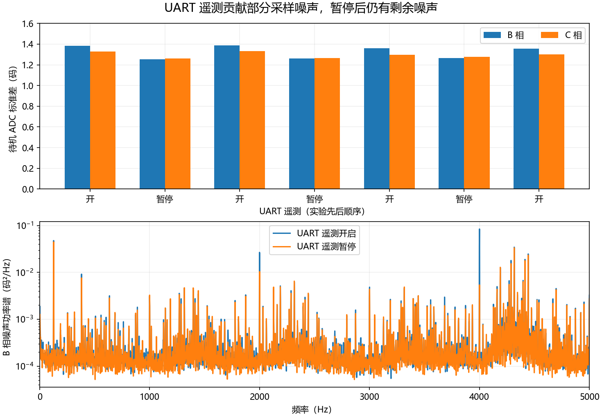

# UART 噪声验证与双 ADC 同步采样可行性

本文记录改造前的核对；后续已完成双 ADC 实现及三轮实机对照，仍使用顺序采样默认，见[双 ADC 实验](dual-adc-experiment-2026-09-27.md)。

## 本轮结论

1. 暂停 UART 遥测，能够重复降低一部分待机采样噪声；剩余噪声仍然明显。
2. M0 的两路电流引脚支持双 ADC 同步采样，按当前板卡接线不需要飞线、更换器件或修改 PCB。
3. 双 ADC 尚未改入正式固件。本轮完成 UART 对照实验和硬件可行性核对，实验后已恢复原正式固件及 UART 功能。

## 1. UART 对照怎样做

使用同一份 `FOC_CAPTURE=ON` 诊断固件，利用已有的 `quiet 0/1` 命令交替开启、暂停 UART 遥测。正式固件不启用这个诊断命令。`quiet` 不关闭 UART 接收，也不暂停 USB 或 ADC；暂停时会跳过 UART 遥测帧构造、排队和 DMA 启动。

条件固定：M0 + TLE5012B，TIM1 触发 8200，ADC 28 周期，电流采样 10 kHz，USB divider=1。全程保持 PWM 三相输出关闭，没有发电流、校准、速度或位置命令。

顺序为：开启 → 暂停 → 开启 → 暂停 → 开启 → 暂停 → 开启。每段先消耗 0.5 秒建立记录，再保存约 4 秒完整原始数据；每次读取诊断变量，确认 `quiet` 命令确实生效。七段均为 idle、PWM off，记录无丢帧或故障。

## 2. 实际降低多少

下表是四段开启记录和三段暂停记录各自的算术平均。噪声标准差从原始 ADC 码计算，不依赖当前安培换算比例。

| 指标 | UART 遥测开启 | 暂停 UART 遥测 | 降幅 |
|---|---:|---:|---:|
| B 相标准差 | 1.372 码 | 1.259 码 | 约 8.3% |
| C 相标准差 | 1.315 码 | 1.268 码 | 约 3.6% |
| B 相约 4 kHz 分量 RMS | 0.407 码 | 0.127 码 | 约 68.7% |
| B 相五周期均值偏移 RMS | 0.464 码 | 0.070 码 | 约 85.0% |

4 kHz 分量采用 Welch 功率谱，积分频带为 3980–4020 Hz，再开方得到幅度 RMS；68.7% 是幅度降幅，不是整体噪声或功率降幅。五周期偏移按控制序号除以 5 的余数分组计算，对应 UART 每五个控制周期一次的遥测活动。



暂停后再开启，相关成分回升；三次暂停都呈现相同方向的变化。因此可以认定 **UART 遥测路径贡献了部分采样噪声**。但 `quiet` 同时改变帧处理、DMA 和 TX 活动，本实验不能独立确定干扰来自 TX 引脚串扰、DMA/CPU 活动，还是供电及地回流。

总标准差只下降几个百分点，说明不能靠取消 UART 功能消除全部噪声。本实验还没有单独测 USB 开/关，也没有验证运行电机时暂停 UART 对电流阶跃的改善程度。

## 3. 双 ADC 为什么不需要改硬件

本项目原理图和驱动的 M0 电流输出分别接 PC0、PC1。STM32F405 数据手册明确列出这两个引脚可连接 ADC1、ADC2、ADC3，并支持同时采样保持和定时器触发。[ST STM32F405 数据手册，ADC 功能及引脚表](https://www.st.com/resource/en/datasheet/dm00037051.pdf)

| 板上信号 | 引脚 | 当前配置 | 可采用的同步配置 |
|---|---|---|---|
| B 相电流放大器输出 | PC0 / ADC123_IN10 | ADC1 注入通道 10 | ADC1 注入通道 10 |
| C 相电流放大器输出 | PC1 / ADC123_IN11 | ADC1 注入通道 11，排在 B 相之后 | ADC2 注入通道 11 |
| 母线分压输出 | PA6 / ADC12_IN6 | ADC2 常规通道 6 | 电流转换结束后再由 ADC2 常规转换 |

这些是芯片内部 ADC 输入选择，现有外部线路可以沿用。特别注意：母线 PA6 是 **ADC12_IN6**，不能直接把现有 PA6 母线搬给 ADC3；如果这样设计，就需要另找引脚和硬件连接。当前推荐方案没有这个需求。[ST 引脚表](https://www.st.com/resource/en/datasheet/dm00037051.pdf)

## 4. 固件必须怎样配合

建议使用 TIM1 原有触发，配置 ADC1/ADC2 双注入同步模式，两路采样长度一致。每次流程为：

```text
TIM1 触发 → ADC1 采 B，相同时间 ADC2 采 C
         → 两路电流转换完成，检查两路数据属于本次采样
         → ADC2 启动母线常规转换，与编码器 SPI 读取重叠
         → 确认母线新数据完成，再运行电流控制
```

主要改动位置：

- `App/Hardware/bsp/bsp_adc_m0.c`：双 ADC 模式、两路注入序列、读取位置、错误及完成状态检查。
- `Core/Src/stm32f4xx_it.c`：两路完成标志处理，母线常规转换调度。
- `App/Config/foc_port.h`：采样保持窗口从顺序两相的 544 个定时器计数调整为同步采样所需的预算。
- `App/FOC/foc.h` 和 `foc.c`：复核窗口边界和电角度预测。ADC 方式仍属于接口驱动配置，FOC 算法继续接收同一时刻的两相电流。

现有 M1 驱动已经采用双 ADC 同步常规转换，可以参考它的数据成对检查方式；M0 的 TIM1 注入触发、母线转换和中断路线不同，不能直接照搬其初始化代码。

## 5. 可以得到什么收益

按当前 21 MHz ADC、28 周期采样和 12 位转换计算：

| 项目 | 当前顺序采样 | 双 ADC 同步采样 |
|---|---:|---:|
| 两相保持时刻差 | 约 1.90 µs | 同一触发同步采样 |
| 触发到两相转换完成 | 约 3.81 µs | 约 1.90 µs |
| 跨控制周期数字滤波延迟 | 无 | 无需因此增加 |

这些是理论时序预算，尚未在本板完成同步驱动实测。同步采样能消除两相时间错位，但不会自动消除运放、参考电压或数字活动引入的共同噪声。PWM 仍在既定更新点生效，也不能把提前拿到 ADC 结果直接解释为整体闭环延迟减少相同数值。

验证时先做待机采样及数据新鲜度检查，再做与顺序采样完全相同的短电流阶跃。PI、UART 活动、USB 记录方式要一致；之后才分别尝试延长 ADC 采样时间或同周期平均，避免混淆哪项修改有效。

## 6. 恢复和记录

实验结束读取诊断固件：ADC 错误、编码器错误、控制时序错误均为 0。随后重新烧录并校验原正式固件，恢复 10 kHz 电流采样、8200 触发、USB divider=2、CDC 1000000、UART 原遥测功能。电机输出关闭。

原始七段数据、频谱和开关状态读取日志在本机 `variants/m1-mt6835/build/bench_debug/20260927_uart_noise/`。归档摘要见 [UART 实验数据](data/uart-noise-20260927.json)。
