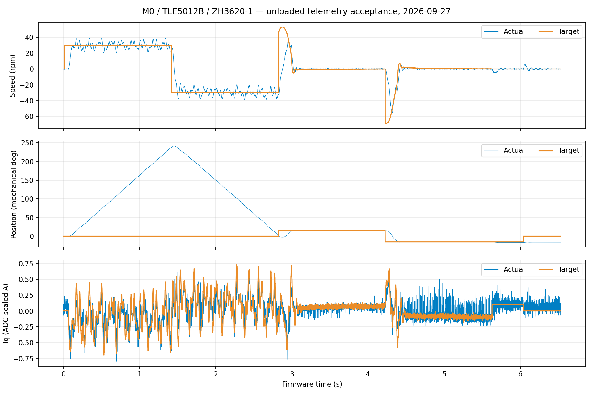

# VOFA 总览与遥测验收（2026-09-27）

## 结论

本轮完成 **M0 + TLE5012B + ZH3620-1、约 12 V、空载** 的总览显示和短测验收。
24 个中文数值卡片、转速/位置/电流三个网格均能实时显示；在 VOFA 发送 `pos 0` 后观察到了模式切换、位置到达以及对应转速、电流变化，随后发送 `stop`，界面确认待机、故障 0、命令拒绝 0。VOFA 已保持连接 COM8。

这是显示、协议和空载短测的功能验收，不代表带载、高速、温升或绝对电流精度已经验收。低速转速波动和偶发遥测跳步仍需改进。

## 这次修正了什么

1. 数值卡片原来有标题而没有数值。VOFA 1.3.10 的 `ChMenu` 应用原生 `index` 属性绑定数据；给 `ctx` 赋值未选中通道。已改为 `index: card.channelIndex`，并移除临时诊断文字和菜单。
2. 历史 `vofa+.datas.csv` 的表头覆盖了配置中的中文通道名。整理表头后，确认此版本在本机读 CSV 使用 GB18030；QML 和 JSON 仍使用 UTF-8。中文名与曲线颜色现已显示正常。
3. 第一轮连接遇到旧 USB 会话积压，复位后恢复。后续多次 VOFA 断开/重新连接，以及 Python 采集结束后返回 VOFA，均收到新数据。采集工具退出时发送停止并继续读取 300 ms，再关闭 DTR，减少未完成传输遗留。异常拔线后的恢复还不能保证无需复位。

## 实机数据

每条运动命令约 1.4 秒，电流短测 0.4 秒；表中实际值是末段最多 500 点（约 0.2 秒）的平均值。

| 命令 | 实际平均值 | 目标减实际 | 实际值标准差 |
|---|---:|---:|---:|
| `rpm 30` | 30.039 rpm | −0.039 rpm | 4.200 rpm |
| `rpm -30` | −30.733 rpm | +0.733 rpm | 4.656 rpm |
| `pos 15` | 15.0029° | −0.0029° | 0.0069° |
| `pos -15` | −15.0092° | +0.0092° | 0.0067° |
| `Iq 0.10` | 0.1134 A | −0.0134 A | 0.0502 A |

电流是板上 ADC 换算的 Iq，不是电源输入电流，也未经独立电流仪器校准。位置是本次软件置零后的机械角度，细小误差不能解释为同等精度的外部测量。

运动记录共 16,318 帧，故障与拒绝均为 0。相邻正常帧时间差 400 us，序号步进 4，对应 **2,500 帧/秒**；每帧 100 字节，净数据约 250 kB/s。速度、位置、Iq 三个误差通道与其对应目标减实际的最大差均为 0。

结束时界面保留告警掩码 1024、最近告警 10：短测电流超过既有告警阈值时留下的历史记录，未触发停机或命令拒绝。它与故障编号 0 并不矛盾；需要清除历史记录时可在停机后发送 `clear`。另复跑了现有 M0 USB 回归程序的 divider=1/2 两种配置，均 PASS；本轮没有改变电机控制参数或重新烧录。

运动记录内部有两次序号步进 16、时间差 1,600 us，各缺 3 个预期遥测点，共 6 点，约占 0.037%。这证明记录不完全连续，不能宣称零丢帧；仅凭遥测无法确定缺点发生在发送还是接收端，也不能据此推断电流环漏执行。各段采集器重新对齐造成的边界缺点单独排除。追加 3 秒待机补测收到 7,482 帧，内部跳步 0，故障 0。

紧凑结果保存于 [JSON 记录](data/vofa-overview-acceptance-20260927.json)；本机原始采样在 `build/overview-acceptance-20260927/overview.npy`。复测工具为 [overview_probe.py](../variants/m1-mt6835/tools/bench/overview_probe.py)，运行前先断开 VOFA 串口。

## 平时怎么使用

1. 打开 VOFA 的 **FOC 总览（send 6）** 标签；连接 **JustFloat / COM8 / 1000000 / 8N1 / 无流控**，保持 DTR 打开。
2. 输入 `send 6`，换行选择 `\n`，点击发送。此命令只切换日志，电机不会因此启动。固件上电也默认发送这一组。
3. 上面 24 张卡片读数，下面同时看三组波形。目标转速、位置、Iq 为橙色，实际值为蓝色；斜坡转速和实际 Id 为绿色，目标 Id 为紫色。
4. `rpm 30` 是 30 rpm 速度控制，`pos 15` 是软件零点后的 15° 位置控制，`Iq 0.10` 是 0.10 A 转矩电流控制。切换模式会改变有关目标，不能把位置模式下的转速目标解释为用户手动设置的恒速。
5. `stop` 关断电机输出。只断开 VOFA 串口不等于停止电机。`clear` 清除历史告警，不改变正在执行的目标。

默认画面显示最近约 2 秒，横轴步长 **0.4 ms**，缓存 25,000 点。±100 rpm、±100°、±1.5 A 的纵轴适合本次短测；超出范围时调整对应图的纵轴。要看 15° 以下的小误差，缩小位置图量程，不要仅凭看起来重合就判断没有误差。

## 全部通道

| 通道（从 0 开始） | 名称 | 含义 |
|---|---|---|
| 0 / 1 | 目标 / 实际转速 | rpm；位置模式的目标转速由位置规划产生 |
| 2 / 3 | 目标 / 实际位置 | 软件零点后的连续机械角度，单位 ° |
| 4 / 5 | 目标 / 实际 Iq | 转矩轴电流，单位 A |
| 6 / 7 | 目标 / 实际 Id | 磁链轴电流，目标目前为 0 A |
| 8 | 母线电压 | ADC 测得的 Vbus，单位 V |
| 9 / 10 | Ud / Uq | 控制器输出电压，单位 V |
| 11 | 控制模式 | 0 电流、1 速度、2 位置；卡片显示中文 |
| 12 | 运行状态 | 0 待机、1 预充电、2 校准、3 保存、4 运行、5 故障、6 校零、7 PWM 校零 |
| 13 | 故障编号 | 0 为无故障 |
| 14 / 15 | 告警位掩码 / 最近告警 | 历史告警；非零不等于已经停机 |
| 16 | 命令拒绝次数 | 判断指令是否被解析或状态条件拒绝 |
| 17 | 电压可用比例 | 饱和缩放比例；结合运行状态解读，待机时可为 0 |
| 18 | 斜坡转速 | 速度环真正使用的参考，可能暂时不同于最终目标 |
| 19 | 速度环误差 | 通道 18 − 通道 1，不是通道 0 − 通道 1 |
| 20 / 21 | 位置 / Iq 误差 | 通道 2 − 3、通道 4 − 5 |
| 22 / 23 | 时间 / 序号 | 低 24 位整数，分别按 2²⁴ us / 2²⁴ 次采样回绕 |

待机时 ADC 与电流坐标换算仍执行，因此 Iq、Id 会显示零点残差和采样噪声，而不一定恰好为 0。故障、无有效零点时这些数据不能作为正常闭环测量解读。转速误差在非速度模式下也只作为数值差值查看。

## 协议与迁移

组 6 为 **24 个普通 little-endian float32 + `00 00 80 7F` 尾标记**，没有原先按位打包、可能显示为 NaN 的头字。M0 控制/采样继续 10 kHz，只有遥测变为 2.5 kHz；USB 设置为 1000000 不改变 USB 物理带宽。其他接口若采用不同控制频率，日志频率须以该配置实际分频为准。

组 0–5 保留原 12 通道格式，适合已有台架分析脚本。切到旧组后，总览 24 通道的名称和绑定不适用；回到总览要发送 `send 6`。旧图表测试须显式选择相应旧组。

保存的 [布局](vofa-overview.tabview.json)、[配置](vofa-overview.config.json)、[通道清单](vofa-overview.channels.json) 与 [控件](vofa/widgets/FOCOverview/FOCOverview.qml) 在项目中。另一台电脑使用时，先将 `FOCOverview` 整个目录复制到 VOFA 安装目录的 `plugins/widgets/`，重启再载入布局。配置/CSV 恢复前备份原数据，避免旧表头覆盖通道名。控件设计参考 [VOFA 官方控件接口](https://www.vofa.plus/docs/learning/widgets/development/)。

## 接下来应改进的顺序

1. 用通道 22/23 长时间记录，配合 USB 队列计数定位两次遥测缺点；先区分日志丢点与控制执行超时。
2. 针对低速周期性转速波动，同时分析电角度、电流和速度估计；不要只看均速达标就继续提高速度 PI。
3. 独立验证电流零点和换算比例，再评估电流噪声；本轮 0.10 A 的瞬时标准差约 0.05 A，不能声称已经达到高精度电流控制。
4. 再增加不同速度、位置距离、负载和较长保持测试，分别报告响应时间、超调、稳态波动与温升。
